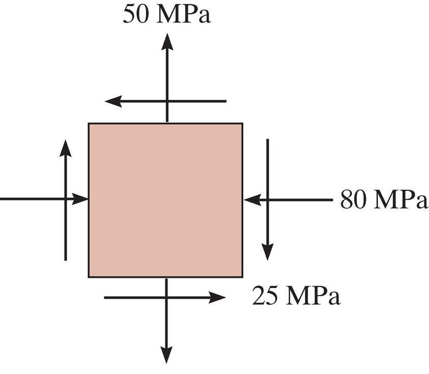
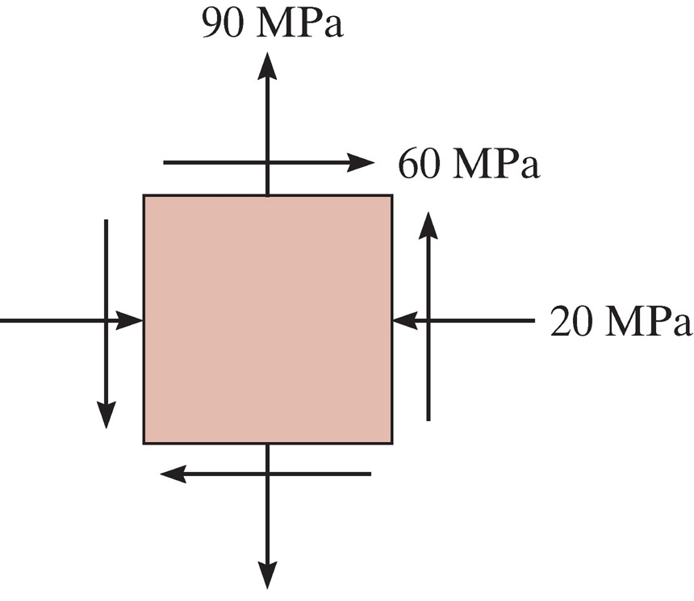

## AE333
## Mechanics of Materials
Lecture 23 - Mohr's Circle 
Dr. Nicholas Smith 
Wichita State University, Department of Aerospace Engineering

1 Apr, 2019

----

## schedule

- 1 Apr - Mohr's Circle
- 3 Apr - Strain Transformation, HW7 Due
- 5 Apr - Deflection of Beams
- 8 Apr - Deflection of Beams, HW8 Due

----
## outline

<!-- vim-markdown-toc GFM -->

* plane stress transformation
* general equations
* principal stresses
* mohr’s circle

<!-- vim-markdown-toc -->

---
# plane stress transformation

----
## plane stress

-   In general, the state of stress at a point is characterized by six stress components
-   In practice, this is rare, as most stresses and forces act in the same plane
-   This case is referred to as plane stress

----
## transformation

----
## procedure

-   If the state of stress (*σ**x*, *σ**y*, *τ**xy*) is known for a known axis system *x* and *y*, we can find the stress relative to some rotated coordinate system
-   We do this by considering a section of the element perpendicular to the *x*′ axis
-   Sum of forces in *x* and *y* will give *σ**x*′ and *τ**x*′*y*′
-   A second section is needed to find *σ**y*′, perpendicular to the *y*′ axis

----
## procedure

----
## example 9.1

 <!-- .element width="50%" -->

Represent the state of stress shown on the fuselage section on an element rotated 30&deg; clockwise from the position shown.

---
# general equations

----
## general equations

-   We can follow the methodology from the previous section to develop equations for some arbitrary rotation and a completely general state of stress
-   We use some trig identities to simplify the formulae

$$\\begin{aligned}
  \\sigma\_{x^\\prime} &= \\frac{\\sigma\_x+\\sigma\_y}{2} + \\frac{\\sigma\_x-\\sigma\_y}{2} \\cos 2\\theta + \\tau\_{xy} \\sin 2\\theta \\\\
  \\tau\_{x^\\prime y^\\prime} &= - \\frac{\\sigma\_x-\\sigma\_y}{2}\\sin 2\\theta + \\tau\_{xy} \\cos 2\\theta
\\end{aligned}$$

-   To find *σ**y*′ we can simply add 90∘ to *θ*

----
## procedure

-   The procedure in general is mostly “plug and chug”
-   The only thing we need to be cautious about is sign convention: stresses are positive in tension, shear is positive with arrows pointing to the 1st and 3rd quadrants, *θ* is measured counter-clockwise from the *x*-axis

----
## example 9.2

 <!-- .element width="40%" -->

Determine the stress at this point on an element rotated 30&deg; clockwise from the position shown.

---
# principal stresses

----
## principal stresses

-   Since the local stresses only change with the rotation angle, we might like to find the angle with gives the maximum stress
-   This is known as the principal direction, and the stresses are known as principal stresses
-   We can find this direction by differentiating the equation for *σ**x*′

----
## principal stress

-   We find the angle as
    $$\\tan 2\\theta\_p = \\frac{2 \\tau\_{xy}}{\\sigma\_x-\\sigma\_y}$$
-   The principal stresses are then
    $$\\sigma\_{1,2} = \\frac{\\sigma\_x+\\sigma\_y}{2} \\pm \\sqrt {\\left( \\frac{\\sigma\_x-\\sigma\_y}{2}\\right)^2 + \\tau\_{xy}^2}$$

----
## maximum shear stress

-   Similarly, we might want to find the direction of maximum shear stress
    $$\\tan 2\\theta\_s = \\frac{\\sigma\_y-\\sigma\_x}{2 \\tau\_{xy}}$$
-   And the maximum shear stress is
    $$\\tau\_{max} = \\sqrt{\\left( \\frac{\\sigma\_x-\\sigma\_y}{2} \\right)^2 + \\tau\_{xy}^2}$$

----
## example 9.3

 <!-- .element width="40%" -->

Find the principal stress for the stress state shown.

----
## example 9.5

-   When torsional loading *T* is applied to a circular bar it produces a state of pure shear stress.
-   Find the maximum in-plane shear stress and the associated average normal stress
-   Find the principal stresses

---
# mohr’s circle

----
## mohr’s circle

-   We can visualize plane stress transformation using a technique known as Mohr’s circle
-   If we re-write the stress transformation equations we find

$$\\begin{aligned}
 \\sigma\_{x^\\prime} - \\left( \\frac{\\sigma\_x + \\sigma\_y}{2} \\right) &= \\left( \\frac{\\sigma\_x - \\sigma\_y}{2} \\right) \\cos 2 \\theta + \\tau\_{xy} \\sin 2\\theta \\\\
 \\tau\_{x^\\prime y^\\prime} &= -\\left( \\frac{\\sigma\_x - \\sigma\_y}{2} \\right) \\sin 2\\theta + \\tau\_{xy} \\cos 2\\theta
\\end{aligned}$$

----
## mohr’s circle

-   If we square each equation and add them together, we find

$$\\left\[\\sigma\_{x^\\prime} - \\left( \\frac{\\sigma\_x + \\sigma\_y}{2} \\right) \\right\]^2 + \\tau\_{x^\\prime y^\\prime}^2 = \\left( \\frac{\\sigma\_x - \\sigma\_y}{2} \\right)^2+\\tau\_{xy}^2$$

----
## mohr’s circle

-   Since *σ**x*, *σ**y* and *τ**xy* are known constants, we can write a more compact form by letting

$$\\begin{aligned}
  (\\sigma\_{x^\\prime}-\\sigma\_{avg})^2 + \\tau\_{x^\\prime y^\\prime}^2 &= R^2\\\\
   \\sigma\_{avg} &= \\frac{\\sigma\_x+\\sigma\_y}{2}\\\\
   R &= \\sqrt{ \\left( \\frac{\\sigma\_x - \\sigma\_y}{2} \\right)^2 + \\tau\_{xy}^2}
\\end{aligned}$$

----
## mohr’s circle

-   Re-written in this way, we can see that the previous equation is the equation of a circle on the *σ*, *τ* axis
-   The center of the circle is at *τ* = 0 and *σ* = *σ**avg*
-   The radius of the circle is $\\sqrt{ \\left( \\frac{\\sigma\_x - \\sigma\_y}{2} \\right)^2 + \\tau\_{xy}^2}$
-   Each point on the circle represents *σ**x*′, *τ**x*′*y*′

----
## mohr’s circle

 <!-- .element width="60%" -->

----
## visual construction of Mohr’s circle

-   By convention, positive *τ* points down, use this convention to plot the center of the circle and a reference point at (*σ**x*, *τ**xy*) where the *x*′ axis is coincident with the *x* axis
-   Use these two points to sketch the circle

----
## principal stress

-   The principal stresses, *σ*1 and *σ*2 are the coordinates where Mohr’s circle intersects the *σ* axis
-   The angles *θ**p*1 and *θ**p*2 can be found by calculating the angle between the reference line and the *σ* axis (note that this angle is equal to 2*θ**p*)
-   Note that the direction from the the reference point to the *σ* axis will be the same as the direction from the *x* axis to the principal axis

----
## maximum shear stress

-   The top and bottom of the circle represent the maximum shear stress
-   The angles *θ**s*1 and *θ**s*2 can be found in a similar method to that described for the principal stress

----
## stress on arbitrary plane

-   To find the stress at some arbitrary plane some known angle *θ* away from our reference plane, we find the angle 2*θ* away from the reference line on Mohr’s circle
-   We can use trigonometry to find the value of the coordinates at that point
-   We must draw our angle in the same direction as the desired rotation

----
## example 9.9

 <!-- .element width="35%" -->

Represent the state of stress shown on an element rotated 30&deg; counterclockwise from the position shown.

