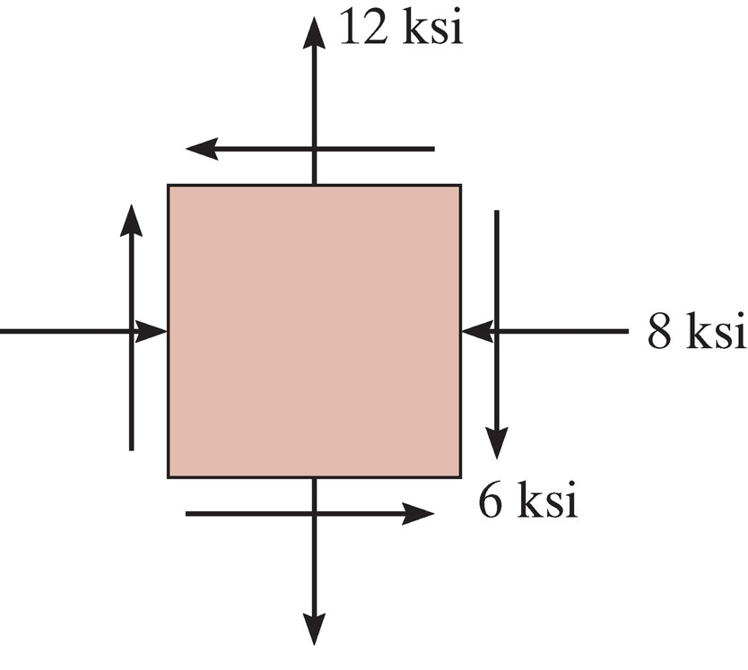

## AE333
## Mechanics of Materials
Lecture 24 - Strain Transformation 
Dr. Nicholas Smith 
Wichita State University, Department of Aerospace Engineering

3 Apr, 2019

----

## schedule

- 3 Apr - Strain Transformation, HW7 Due
- 5 Apr - Deflection of Beams
- 8 Apr - Deflection of Beams, HW8 Due
- 10 Apr - Deflection of Beams

----
## outline

<!-- vim-markdown-toc GFM -->

* mohr’s circle
* absolute maximum shear
* plane strain
* principal strains and mohr’s circle
* strain rosettes
* material property relationships

<!-- vim-markdown-toc -->

---
# mohr’s circle

----
## mohr’s circle

-   We can visualize plane stress transformation using a technique known as Mohr’s circle
-   If we re-write the stress transformation equations we find

$$\\begin{aligned}
 \\sigma\_{x^\\prime} - \\left( \\frac{\\sigma\_x + \\sigma\_y}{2} \\right) &= \\left( \\frac{\\sigma\_x - \\sigma\_y}{2} \\right) \\cos 2 \\theta + \\tau\_{xy} \\sin 2\\theta \\\\
 \\tau\_{x^\\prime y^\\prime} &= -\\left( \\frac{\\sigma\_x - \\sigma\_y}{2} \\right) \\sin 2\\theta + \\tau\_{xy} \\cos 2\\theta
\\end{aligned}$$

----
## mohr’s circle

-   If we square each equation and add them together, we find

$$\\left\[\\sigma\_{x^\\prime} - \\left( \\frac{\\sigma\_x + \\sigma\_y}{2} \\right) \\right\]^2 + \\tau\_{x^\\prime y^\\prime}^2 = \\left( \\frac{\\sigma\_x - \\sigma\_y}{2} \\right)^2+\\tau\_{xy}^2$$

----
## mohr’s circle

-   Since *σ**x*, *σ**y* and *τ**xy* are known constants, we can write a more compact form by letting

$$\\begin{aligned}
  (\\sigma\_{x^\\prime}-\\sigma\_{avg})^2 + \\tau\_{x^\\prime y^\\prime}^2 &= R^2\\\\
   \\sigma\_{avg} &= \\frac{\\sigma\_x+\\sigma\_y}{2}\\\\
   R &= \\sqrt{ \\left( \\frac{\\sigma\_x - \\sigma\_y}{2} \\right)^2 + \\tau\_{xy}^2}
\\end{aligned}$$

----
## mohr’s circle

-   Re-written in this way, we can see that the previous equation is the equation of a circle on the *σ*, *τ* axis
-   The center of the circle is at *τ* = 0 and *σ* = *σ**avg*
-   The radius of the circle is $\\sqrt{ \\left( \\frac{\\sigma\_x - \\sigma\_y}{2} \\right)^2 + \\tau\_{xy}^2}$
-   Each point on the circle represents *σ**x*′, *τ**x*′*y*′

----
## mohr’s circle

 <!-- .element width="60%" -->

----
## visual construction of Mohr’s circle

-   By convention, positive *τ* points down, use this convention to plot the center of the circle and a reference point at (*σ**x*, *τ**xy*) where the *x*′ axis is coincident with the *x* axis
-   Use these two points to sketch the circle

----
## principal stress

-   The principal stresses, *σ*1 and *σ*2 are the coordinates where Mohr’s circle intersects the *σ* axis
-   The angles *θ**p*1 and *θ**p*2 can be found by calculating the angle between the reference line and the *σ* axis (note that this angle is equal to 2*θ**p*)
-   Note that the direction from the the reference point to the *σ* axis will be the same as the direction from the *x* axis to the principal axis

----
## maximum shear stress

-   The top and bottom of the circle represent the maximum shear stress
-   The angles *θ**s*1 and *θ**s*2 can be found in a similar method to that described for the principal stress

----
## stress on arbitrary plane

-   To find the stress at some arbitrary plane some known angle *θ* away from our reference plane, we find the angle 2*θ* away from the reference line on Mohr’s circle
-   We can use trigonometry to find the value of the coordinates at that point
-   We must draw our angle in the same direction as the desired rotation

----
## example 9.9

 <!-- .element width="35%" -->

Represent the state of stress shown on an element rotated 30&deg; counterclockwise from the position shown.

---
# absolute maximum shear

----
## absolute maximum shear

-   We already know how to find the maximum in-plane shear, but sometimes the maximum shear stress can occur in another plane
-   We can do this (without treating it as a fully 3D problem) by treating each plane as its own plane stress problem

----
## mohr’s circle

 <!-- .element width="40%" -->

----
## mohr’s circle

 <!-- .element width="40%" -->

----
## absolute max shear

-   The maximum absolute shear will depend on whether *σ*1 and *σ*2 are in the same or opposite directions

$$\\begin{aligned}
  \\tau\_{abs,max} &= \\frac{\\sigma\_1}{2} & \\qquad \\text{same direction} \\\\
  \\tau\_{abs,max} &= \\frac{\\sigma\_1-\\sigma\_2}{2} & \\qquad \\text{opposite directions}
\\end{aligned}$$

-   Which of the three mohr’s circles the maximum occurs in will determine which plane the shear acts in

---
# plane strain

----
## plane strain

-   Under plane stress we assume no out-of-plane stresses are present
-   This is typically a good assumption for very thin materials
-   Under plane strain we assume no out-of-plane strains are present
-   Typically a good assumption for very thick materials

----
## sign convention

-   Normal strains, *ϵ**x* and *ϵ**y*, are considered positive when they cause elongation, and negative when they cause contraction
-   Shear strains, *γ**xy* are positive if the interior angle becomes smaller than 90∘, and negative if the angles becomes larger than 90∘

----
## general equations

-   We derive the general strain transformation equations by comparing infinitesimal elements before and after deformation
-   To find *γ**x*′*y*′ we compare the angle between *dx* and *dy* before and after deformation

----
## general equations

-   The equations are nearly exactly the same as the stress transformation equations
-   Pay attention to the difference, strain transformation equations are NOT on the equation sheet
$$\\begin{aligned}
  \\epsilon\_{x^\\prime} &= \\frac{\\epsilon\_x+\\epsilon\_y}{2} + \\frac{\\epsilon\_x-\\epsilon\_y}{2}\\cos 2 \\theta + \\frac{\\gamma\_{xy}}{2} \\sin 2\\theta \\\\
  \\frac{\\gamma\_{x^\\prime y^\\prime}}{2} &= -\\left( \\frac{\\epsilon\_x-\\epsilon\_y}{2}\\right)\\sin 2 \\theta + \\frac{\\gamma\_{xy}}{2} \\cos 2\\theta
\\end{aligned}$$

-   As with *σ**y*′, we find *ϵ**y*′ by letting *θ**y* = *θ**x* + 90∘

----
## engineering strain

-   Side note: there is another definition of shear strain known as tensorial shear strain, where *γ**xy* = 2*ϵ**xy*
-   Under tensorial strain, the transformation equations are exactly the same (as in this case both stress and strain are tensors)
-   *γ**xy* is known as engineering strain, you will need to pay attention to which strain convention is used when extracting data from finite elements or other sources

---
# principal strains and mohr’s circle

----
## principal strains

-   As you might imagine, since the transformation equations are nearly identical so are the principal strain equations
$$\\begin{aligned}
  \\tan 2\\theta\_p &= \\frac{\\gamma\_{xy}}{\\epsilon\_x-\\epsilon\_y}\\\\
  \\epsilon\_{1,2} &= \\frac{\\epsilon\_x+\\epsilon\_y}{2} \\pm \\sqrt{ \\left( \\frac{\\epsilon\_x-\\epsilon\_y}{2}\\right)^2 + \\left(\\frac{\\gamma\_{xy}}{2}\\right)^2}
\\end{aligned}$$

----
## mohr’s circle

-   Mohr’s circle can also be used in exactly the same way for strain as it is for stress
-   The only difference is that the vertical axis is tensor strain, or *γ**xy*/2

----
## example 10.4

 

The state of plane strain at a point has components of `$\epsilon_x = 250 \mu \epsilon$`, `$\epsilon_y = -150 \mu \epsilon$`, and `$\gamma_{xy} = 120 \mu \epsilon$`. Determine the principal strains and the direction they act.

---
# strain rosettes

----
## rosettes

-   Normal strain is fairly easy to measure using a strain gage
-   Shear strain is more difficult to measure directly, so instead a “rossette” of normal strain gages is used
-   We can use the strain transformation equations to determine *τ**xy*

----
## rosettes

-   Usually, we have *θ**a* = 0, *θ**b* = 90 and *θ**c* = 45 OR *θ**a* = 0, *θ**b* = 60 and *θ**c* = 120

$$\\begin{aligned}
  \\epsilon\_{a} &= \\frac{\\epsilon\_x+\\epsilon\_y}{2} + \\frac{\\epsilon\_x-\\epsilon\_y}{2}\\cos 2 \\theta\_a + \\frac{\\gamma\_{xy}}{2} \\sin 2\\theta\_a \\\\
  \\epsilon\_{b} &= \\frac{\\epsilon\_x+\\epsilon\_y}{2} + \\frac{\\epsilon\_x-\\epsilon\_y}{2}\\cos 2 \\theta\_b + \\frac{\\gamma\_{xy}}{2} \\sin 2\\theta\_b \\\\
  \\epsilon\_{c} &= \\frac{\\epsilon\_x+\\epsilon\_y}{2} + \\frac{\\epsilon\_x-\\epsilon\_y}{2}\\cos 2 \\theta\_c + \\frac{\\gamma\_{xy}}{2} \\sin 2\\theta\_c
\\end{aligned}$$

----
## example 10.8

 

The readings from the rosette shown are `$\epsilon_a=60\mu\epsilon$`, `$\epsilon_b=135\mu\epsilon$` and `$\epsilon_c=264\mu\epsilon$`. Find the in-plane principal strains and their directions.

---
# material property relationships

----
## generalized hooke’s law

-   We have previously used Hooke’s Law in 2D, in 3D we have

$$\\begin{aligned}
  \\epsilon\_x &= \\frac{1}{E}\[\\sigma\_x - \\nu(\\sigma\_y + \\sigma\_z)\]\\\\
  \\epsilon\_y &= \\frac{1}{E}\[\\sigma\_y - \\nu(\\sigma\_x + \\sigma\_z)\]\\\\
  \\epsilon\_z &= \\frac{1}{E}\[\\sigma\_z - \\nu(\\sigma\_x + \\sigma\_y)\]
\\end{aligned}$$

----
## generalized hooke’s law

-   And in shear

$$\\begin{aligned}
  \\gamma\_{xy} &= \\frac{1}{G} \\tau\_{xy}\\\\
  \\gamma\_{yz} &= \\frac{1}{G} \\tau\_{yz}\\\\
  \\gamma\_{xz} &= \\frac{1}{G} \\tau\_{xz}
\\end{aligned}$$

----
## dilatation

-   When a material deforms it often changes volume
-   The change in volume per unit volume is called “volumetric strain” or dilatation

$$e = \\frac{\\partial V}{d V} = \\epsilon\_x + \\epsilon\_y + \\epsilon\_z = \\frac{1-2\\nu}{E}(\\sigma\_x+\\sigma\_y+\\sigma\_z)$$

----
## hydrostatic pressure

-   One way of characterizing volumetric response is to apply hydrostatic pressure (equal compression on all sides with no shear)
-   Under this case, we have

$$\\frac{p}{e} = -\\frac{E}{3(1-2\\nu)}$$

-   We call the term on the right (with no negative sign) the bulk modulus, *k*

