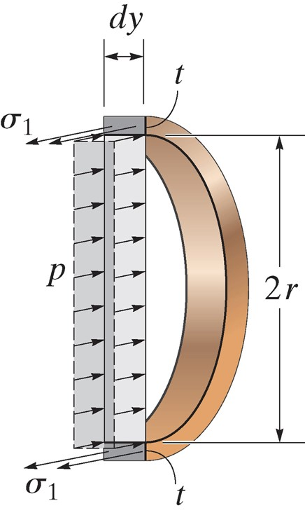
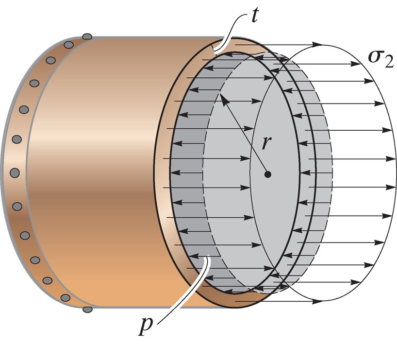
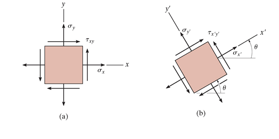
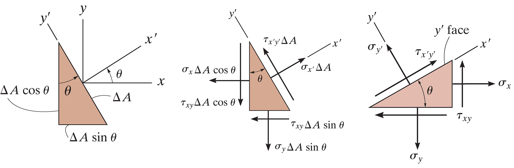
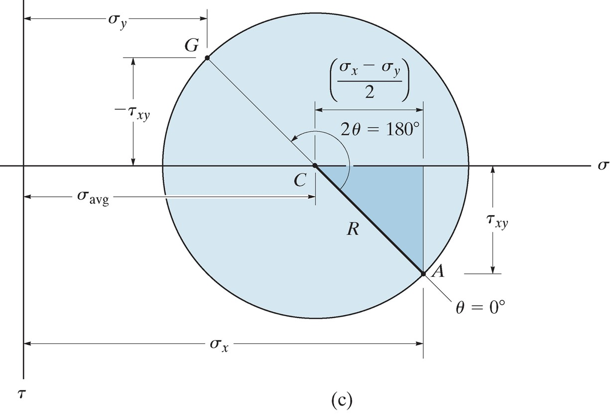

## AE333
## Mechanics of Materials
Lecture 32 - Exam 3 Review  
Dr. Nicholas Smith 
Wichita State University, Department of Aerospace Engineering

22 Apr, 2019

----

## schedule

- 22 Apr - Exam 3 Review, HW 10 Due
- 24 Apr - Exam 3
- 26 Apr - Stress Concentration

----
## outline

<!-- vim-markdown-toc GFM -->

* exam 3
* transverse shear
* combined loading
* stress and strain transformation
* beam deformation

<!-- vim-markdown-toc -->

---
# exam 3

----
## exam format

- 4 questions 
- Similar format to past exams
- Remember that transverse shear was not on last year's exam 3, but will be on this year's
- Appendix C will also be provided, in addition to equation sheet

---
# transverse shear

----
## shear

-   We have discussed the internal stresses caused by the internal moment *M*
-   There are also internal shear stresses caused by the internal shear force *V*
-   We can illustrate the effect of internal shear stress by considering three boards, either resting on top of on another or bonded

----
## shear

 <!-- .element width="60%" -->

----
## shear formula

-   Internal shear causes a more complicated deformation state, so we will use an indirect method to find the shear stress-strain distribution
-   We will consider equilibrium along a section of a beam, then we will consider another section

----
## equilibrium

----
## equilibrium

 <!-- .element width="50%" -->

----
## equilibrium

-   There must be a shear force along the bottom to equilibrate the different stresses on either side of the section
-   If we assume that this shear is constant through the thickness, we obtain the following from equilibrium
`$$\sum F_x = 0 = \int_{A^\prime} \sigma^\prime dA^\prime - \int_{A^\prime} \sigma dA^\prime - \tau (t dx)$$`

----
## equilibrium
$$\\tiny{\\begin{aligned}
  0 &= \\int\_{A^\\prime} \\left( \\frac{M + dM}{I} \\right) y dA^\\prime - \\int\_{A^\\prime} \\left( \\frac{M}{I} \\right)y dA^\\prime - \\tau(t dx) \\\\
  \\left( \\frac{M}{I} \\right) \\int\_{A^\\prime} y dA^\\prime &= \\tau (t dx)\\\\
  \\tau &= \\frac{1}{It} \\left( \\frac{dM}{dx} \\right)\\int\_{A^\\prime} y dA^\\prime
\\end{aligned}}$$

----
## shear formula

-   In this formula, recall that $V = \\frac{dM}{dx}$
-   We also call *Q* the moment of the area `$A^\prime$` which is equal to `$\int_{a^\prime} y dA^\prime$`
-   We can also write *Q* in terms of the centroid
$$Q = \\bar{y}^\\prime A^\\prime$$

----
## shear formula

-   Simplified, the shear formula is
$$\\tau = \\frac{VQ}{It}$$
-   *Q* poses the greatest difficulty in calculations, so we will consider a few examples

----
## Q

-   *Q* represents the moment of the cross-sectional area above (or below) the point at which the shear stress is being calculated
-   We apply the formula to that area

----
## Q

 <!-- .element width="35%" -->

----
## shear formula limitations

-   A major assumption made is that the shear stress was constant through the thickness, essentially we have found the average shear
-   This is more accurate the more slender a beam is (small *b* and large *h*)
-   The formula is also not accurate for cross sections that change or have boundaries that are not right angles

----
## procedure

-   First we find the internal shear, *V*
-   Find *I*, the moment of inertia (of the entire section) about the neutral axis
-   Find *t* from an imaginary cross-section at the point of interest
-   Calculate *Q* from either the area above or below the point of interest
-   $\tau$ acts in the same direction as *V* (and must be equilibrated on other faces)

----
## built-up members

-   Often in practice, structural members are "built-up"
-   This refers to parts that are comprised of several other parts to have greater strength in certain areas
-   We need to analyze the shear between these members to choose appropriate adhesives or fasteners

----
## equilibrium

----
## equilibrium

-   From equilibrium we see that

$$dF = \\frac{dM}{I} \\int\_{A^\\prime} y dA^\\prime$$

-   We recall that this integral represents *Q*, we can also define the shear flow as *q*=*dF*/*dx* and recall that *dM*/*dx*=*V* to find

$$q = \\frac{VQ}{I}$$

----
## fastener spacing

-   We can use shear flow to determine fastener spacing
-   Say a fastener can support a shear force of *F*0 before failure
-   The shear flow (force/distance) times the spacing (distance) will give the shear force per fastener
    *F*=*qs*

----
## multiple fasteners

----
## multiple fasteners

-   When multiple arms are connecting the same area (as shown in the previous slide)
-   The shear flow "seen" by each fastener is *q*/*n* where *n* is the number of fastners per area

---
# combined loading

----
## thin-walled pressure vessels

-   If the radius to wall thickness ratio is 10 or more, we can treet a pressure vessule as “thin-walled”
-   Cylindrical pressure vessels will have two primary sources of stress, and serve as an introduction to more general states of combined loading

----
## cylindrical vessels

 <!-- .element width="30%" -->

----
## cylindrical vessels

-   From equilibrium of a section of a cylindrical vessel, we see that

$$\\begin{aligned}
  \\sum F\_x &= 0\\\\
  &= 2(\\sigma\_1 t dy) - p (2r) dy\\\\
  \\sigma\_1 &= \\frac{pr}{t}
\\end{aligned}$$

----
## cylindrical vessels

 <!-- .element width="50%" -->

----
## cylindrical vessels

-   Considering another section we can find the longitudinal stress

$$\\begin{aligned}
  \\sum F\_y &= 0\\\\
  &= \\sigma\_2 (2\\pi rt) - p (\\pi r^2)\\\\
  \\sigma\_2 &= \\frac{pr}{2t}
\\end{aligned}$$

----
## spherical vessels

-   We can find the stress in spherical vessels using an identical section to the longitudinal section for a cylindrical vessel, and we find that

$$\\sigma = \\frac{pr}{2t}$$

-   Which is valid everywhere in a cylindrical vessel

----
## combined loading

-   We can use the principle of superposition to treat various loading conditions separately and then add them together to find the total stress

----
## procedure

-   Section the member at the point of interest, internal force components should be drawn acting through the centroid of the section
-   Moment components should be calculated about the centroidal axis

----
## stress components

-   Normal stress: *σ* = *N*/*A*
-   Shear: *τ* = Q*/*It
-   Bending: *σ* = y*/*I
-   Torsion: *τ* = ρ*/*J
-   Pressure Vessels: *σ*1 = r*/*t*, *σ*2 =*r*/2*t

---
# stress and strain transformation

----
## plane stress

-   In general, the state of stress at a point is characterized by six stress components
-   In practice, this is rare, as most stresses and forces act in the same plane
-   This case is referred to as plane stress

----
## transformation

----
## procedure

-   If the state of stress (*σ**x*, *σ**y*, *τ**xy*) is known for a known axis system *x* and *y*, we can find the stress relative to some rotated coordinate system
-   We do this by considering a section of the element perpendicular to the *x*′ axis
-   Sum of forces in *x* and *y* will give *σ**x*′ and *τ**x*′*y*′
-   A second section is needed to find *σ**y*′, perpendicular to the *y*′ axis

----
## procedure

----
## general equations

-   We can follow the methodology from the previous section to develop equations for some arbitrary rotation and a completely general state of stress
-   We use some trig identities to simplify the formulae
$$\\begin{aligned}
  \\sigma\_{x^\\prime} &= \\frac{\\sigma\_x+\\sigma\_y}{2} + \\frac{\\sigma\_x-\\sigma\_y}{2} \\cos 2\\theta + \\tau\_{xy} \\sin 2\\theta \\\\
  \\tau\_{x^\\prime y^\\prime} &= - \\frac{\\sigma\_x-\\sigma\_y}{2}\\sin 2\\theta + \\tau\_{xy} \\cos 2\\theta
\\end{aligned}$$
-   To find *σ**y*′ we can simply add 90∘ to *θ*

----
## procedure

-   The procedure in general is mostly “plug and chug”
-   The only thing we need to be cautious about is sign convention: stresses are positive in tension, shear is positive with arrows pointing to the 1st and 3rd quadrants, *θ* is measured counter-clockwise from the *x*-axis

----
## principal stresses

-   Since the local stresses only change with the rotation angle, we might like to find the angle with gives the maximum stress
-   This is known as the principal direction, and the stresses are known as principal stresses
-   We can find this direction by differentiating the equation for *σ**x*′

----
## principal stress

-   We find the angle as
    $$\\tan 2\\theta\_p = \\frac{2 \\tau\_{xy}}{\\sigma\_x-\\sigma\_y}$$
-   The principal stresses are then
    $$\\sigma\_{1,2} = \\frac{\\sigma\_x+\\sigma\_y}{2} \\pm \\sqrt {\\left( \\frac{\\sigma\_x-\\sigma\_y}{2}\\right)^2 + \\tau\_{xy}^2}$$

----
## maximum shear stress

-   Similarly, we might want to find the direction of maximum shear stress
    $$\\tan 2\\theta\_s = \\frac{\\sigma\_y-\\sigma\_x}{2 \\tau\_{xy}}$$
-   And the maximum shear stress is
    $$\\tau\_{max} = \\sqrt{\\left( \\frac{\\sigma\_x-\\sigma\_y}{2} \\right)^2 + \\tau\_{xy}^2}$$

----
## mohr’s circle

-   We can visualize plane stress transformation using a technique known as Mohr’s circle
-   If we re-write the stress transformation equations we find

$$\\begin{aligned}
 \\sigma\_{x^\\prime} - \\left( \\frac{\\sigma\_x + \\sigma\_y}{2} \\right) &= \\left( \\frac{\\sigma\_x - \\sigma\_y}{2} \\right) \\cos 2 \\theta + \\tau\_{xy} \\sin 2\\theta \\\\
 \\tau\_{x^\\prime y^\\prime} &= -\\left( \\frac{\\sigma\_x - \\sigma\_y}{2} \\right) \\sin 2\\theta + \\tau\_{xy} \\cos 2\\theta
\\end{aligned}$$

----
## mohr’s circle

-   If we square each equation and add them together, we find

$$\\left\[\\sigma\_{x^\\prime} - \\left( \\frac{\\sigma\_x + \\sigma\_y}{2} \\right) \\right\]^2 + \\tau\_{x^\\prime y^\\prime}^2 = \\left( \\frac{\\sigma\_x - \\sigma\_y}{2} \\right)^2+\\tau\_{xy}^2$$

----
## mohr’s circle

-   Since *σ**x*, *σ**y* and *τ**xy* are known constants, we can write a more compact form by letting

$$\\begin{aligned}
  (\\sigma\_{x^\\prime}-\\sigma\_{avg})^2 + \\tau\_{x^\\prime y^\\prime}^2 &= R^2\\\\
   \\sigma\_{avg} &= \\frac{\\sigma\_x+\\sigma\_y}{2}\\\\
   R &= \\sqrt{ \\left( \\frac{\\sigma\_x - \\sigma\_y}{2} \\right)^2 + \\tau\_{xy}^2}
\\end{aligned}$$

----
## mohr’s circle

-   Re-written in this way, we can see that the previous equation is the equation of a circle on the *σ*, *τ* axis
-   The center of the circle is at *τ* = 0 and *σ* = *σ**avg*
-   The radius of the circle is $\\sqrt{ \\left( \\frac{\\sigma\_x - \\sigma\_y}{2} \\right)^2 + \\tau\_{xy}^2}$
-   Each point on the circle represents *σ**x*′, *τ**x*′*y*′

----
## mohr’s circle

 <!-- .element width="60%" -->

----
## visual construction of Mohr’s circle

-   By convention, positive *τ* points down, use this convention to plot the center of the circle and a reference point at (*σ**x*, *τ**xy*) where the *x*′ axis is coincident with the *x* axis
-   Use these two points to sketch the circle

----
## principal stress

-   The principal stresses, *σ*1 and *σ*2 are the coordinates where Mohr’s circle intersects the *σ* axis
-   The angles *θ**p*1 and *θ**p*2 can be found by calculating the angle between the reference line and the *σ* axis (note that this angle is equal to 2*θ**p*)
-   Note that the direction from the the reference point to the *σ* axis will be the same as the direction from the *x* axis to the principal axis

----
## maximum shear stress

-   The top and bottom of the circle represent the maximum shear stress
-   The angles *θ**s*1 and *θ**s*2 can be found in a similar method to that described for the principal stress

----
## stress on arbitrary plane

-   To find the stress at some arbitrary plane some known angle *θ* away from our reference plane, we find the angle 2*θ* away from the reference line on Mohr’s circle
-   We can use trigonometry to find the value of the coordinates at that point
-   We must draw our angle in the same direction as the desired rotation

----
## absolute maximum shear

-   We already know how to find the maximum in-plane shear, but sometimes the maximum shear stress can occur in another plane
-   We can do this (without treating it as a fully 3D problem) by treating each plane as its own plane stress problem

----
## mohr’s circle

 <!-- .element width="40%" -->

----
## mohr’s circle

 <!-- .element width="40%" -->

----
## absolute max shear

-   The maximum absolute shear will depend on whether *σ*1 and *σ*2 are in the same or opposite directions

$$\\begin{aligned}
  \\tau\_{abs,max} &= \\frac{\\sigma\_1}{2} & \\qquad \\text{same direction} \\\\
  \\tau\_{abs,max} &= \\frac{\\sigma\_1-\\sigma\_2}{2} & \\qquad \\text{opposite directions}
\\end{aligned}$$

-   Which of the three mohr’s circles the maximum occurs in will determine which plane the shear acts in

----
## plane strain

-   Under plane stress we assume no out-of-plane stresses are present
-   This is typically a good assumption for very thin materials
-   Under plane strain we assume no out-of-plane strains are present
-   Typically a good assumption for very thick materials

----
## sign convention

-   Normal strains, *ϵ**x* and *ϵ**y*, are considered positive when they cause elongation, and negative when they cause contraction
-   Shear strains, *γ**xy* are positive if the interior angle becomes smaller than 90∘, and negative if the angles becomes larger than 90∘

----
## general equations

-   We derive the general strain transformation equations by comparing infinitesimal elements before and after deformation
-   To find *γ**x*′*y*′ we compare the angle between *dx* and *dy* before and after deformation

----
## general equations

-   The equations are nearly exactly the same as the stress transformation equations
-   Pay attention to the difference, strain transformation equations are NOT on the equation sheet

$$\\begin{aligned}
  \\epsilon\_{x^\\prime} &= \\frac{\\epsilon\_x+\\epsilon\_y}{2} + \\frac{\\epsilon\_x-\\epsilon\_y}{2}\\cos 2 \\theta + \\frac{\\gamma\_{xy}}{2} \\sin 2\\theta \\\\
  \\frac{\\gamma\_{x^\\prime y^\\prime}}{2} &= -\\left( \\frac{\\epsilon\_x-\\epsilon\_y}{2}\\right)\\sin 2 \\theta + \\frac{\\gamma\_{xy}}{2} \\cos 2\\theta
\\end{aligned}$$

-   As with *σ**y*′, we find *ϵ**y*′ by letting *θ**y* = *θ**x* + 90∘

----
## engineering strain

-   Side note: there is another definition of shear strain known as tensorial shear strain, where *γ**xy* = 2*ϵ**xy*
-   Under tensorial strain, the transformation equations are exactly the same (as in this case both stress and strain are tensors)
-   *γ**xy* is known as engineering strain, you will need to pay attention to which strain convention is used when extracting data from finite elements or other sources

----
## rosettes

-   Normal strain is fairly easy to measure using a strain gage
-   Shear strain is more difficult to measure directly, so instead a “rossette” of normal strain gages is used
-   We can use the strain transformation equations to determine *τ**xy*

----
## rosettes

-   Usually, we have *θ**a* = 0, *θ**b* = 90 and *θ**c* = 45 OR *θ**a* = 0, *θ**b* = 60 and *θ**c* = 120

$$\\begin{aligned}
  \\epsilon\_{a} &= \\frac{\\epsilon\_x+\\epsilon\_y}{2} + \\frac{\\epsilon\_x-\\epsilon\_y}{2}\\cos 2 \\theta\_a + \\frac{\\gamma\_{xy}}{2} \\sin 2\\theta\_a \\\\
  \\epsilon\_{b} &= \\frac{\\epsilon\_x+\\epsilon\_y}{2} + \\frac{\\epsilon\_x-\\epsilon\_y}{2}\\cos 2 \\theta\_b + \\frac{\\gamma\_{xy}}{2} \\sin 2\\theta\_b \\\\
  \\epsilon\_{c} &= \\frac{\\epsilon\_x+\\epsilon\_y}{2} + \\frac{\\epsilon\_x-\\epsilon\_y}{2}\\cos 2 \\theta\_c + \\frac{\\gamma\_{xy}}{2} \\sin 2\\theta\_c
\\end{aligned}$$

---
# beam deformation

----
## elastic curve

-   Before finding the exact displacement, it is useful to sketch the approximate deformed shape of a beam
-   For difficult beams, it is useful to draw the moment curve first
-   Positive internal moment tends to bend the beam concave up, while negative moment tends to bend the beam concave down

----
## elastic curve

 <!-- .element width="40%" -->

----
## elastic curve

 <!-- .element width="40%" -->

----
## moment-curvature

-   In Chapter 6 we compared the strain in a segement of a beam to the radius of curvature and found

$$\\frac{1}{\\rho} = -\\frac{\\epsilon}{y}$$

-   Since Hooke’s Law applies, *ϵ* = *σ*/*E* = −*My*/*EI*, substituting gives

$$\\frac{1}{\\rho} = \\frac{M}{EI}$$

----
## sign convention

 <!-- .element width="60%" -->

`$\rho$` is positive when the center of the arc is above the beam, negative when it is below.

----
## curvature

-   When talking about displacement in beams, we use the coordinates *v* and *x*, where *v* is the vertical displacement and *x* is the horizontal position
-   In this notation, curvature is formally related to displacement according to

$$\\frac{1}{\\rho} = \\frac{d^2v/dx^2}{\[1+(dv/dx)^2\]^{3/2}} = \\frac{M}{EI}$$

----
## curvature

-   The previous equation is difficult to solve in general, but for cases of small displacement, (*dv*/*dx*)2 will be negligible compared to 1, which then simplifies to

$$\\frac{d^2v}{dx^2} = \\frac{M}{EI}$$

----
## flexural rigidity

-   In general, *M*, is a function of *x*, but *EI* (known as the flexural rigidity) is a constant along the length of the beam
-   In this case, we can say

$$\\begin{aligned}
  EI\\frac{d^2v}{dx^2} &= M(x) \\\\
  EI\\frac{d^3v}{dx^3} &= V(x) \\\\
  EI\\frac{d^4v}{dx^4} &= w(x)
\\end{aligned}$$

----
## boundary conditions

-   If a support restricts displacement, but not rotation, we will have a boundary condition of *v* = 0 at that point
-   Supports that restrict rotation give a boundary condition that *θ* = 0

----
## continuity conditions

-   If we have a piecewise function for *M*(*x*), not all integration constants can be found from the boundary conditions
-   Instead, we must also use continuity conditions to ensure that the slope and displacement are continuous at every point
-   In other words, for two sets of functions, *θ*1(*x*) and *v*1(*x*), *θ*2(*x*), and *v*2(*x*), *θ*1(*a*)=*θ*2(*a*) and *v*1(*a*)=*v*2(*a*)

----
## slope

-   For small displacements, we have
    *θ* ≈ tan*θ* = *dv*/*dx*

----
## discontinuity functions

-   Direct integration can be very cumbersome if multiple loads or boundary conditions are applied
-   Instead of using a piecewise function, we can use discontinuity functions

----
## Macaulay functions

-   Macaulay functions can be used to describe various loading conditions, the general definition is

$$\\langle x-a\\rangle^n = \\begin{cases}
  0 & \\text{for } x &lt; a\\\\
  (x-a)^n & \\text{for } x \\ge a
\\end{cases}
n \ge 0$$

----
## singularity functions

-   Singularity functions are used for concentrated forces and can be written
    
$$w = P\\langle x-a\\rangle^{-1} = \\begin{cases}
  0 & \\text{for } x\\ne a\\\\
  P & \\text{for } x=a
\\end{cases}$$

----
## discontinuity functions

 <!-- .element width="40%" -->

----
## discontinuity functions

1. We add these up for each loading case along our beam
2. We integrate as usual to find displacement from load, slope, or moment

----
## integration

- discontinuity functions follow special rules for integration
- when n &ge; 0, they integrate like a normal polynomial
- when n &lt; 0, they instead follow 

$$ \int \langle x-a \rangle ^n dx = \langle x - a \rangle ^{n+1} $$

----
## signs

- we need to be careful to match the sign convention
- loads are defined as positive when they act upward
- moments are defined as positive when they act clockwise

----
## superposition

-   The differential equation *EId*4*v*/*dx*4 = *w*(*x*) satisfies the requirements for superposition
-   *w*(*x*) is linearly related to *v*(*x*)
-   Load does not significantly change the shape of the beam

----
## superposition

-   This means we can superpose multiple deflection solutions from simpler cases
-   Appendix C in the text has many solutions that can be superposed

----
## statically indeterminate

-   If we have redundant supports, we can have some difficulty finding the displacement
-   There are several approaches to solve these problems, we will consider direct integration and superposition

----
## integration

-   We can take the extra unknowns and include them in our formulation for *M*(*x*)
-   They will be solved for with the extra boundary conditions applied

----
## superposition

-   To use superposition for finding deflection of statically indeterminate beams, we must first identify redundant reactions
-   We initially remove these, then superpose them back such that the deflection at that point is 0
-   The choice of which reaction(s) is redundant is arbitrary, we can choose whatever we are most comfortable with
-   We use Appendix C to find deflection and slope

----
## superposition

We can consider any reaction to be redundant.

----
## higher order indeterminacy

We need to treat each reaction separately to match Appendix C.

