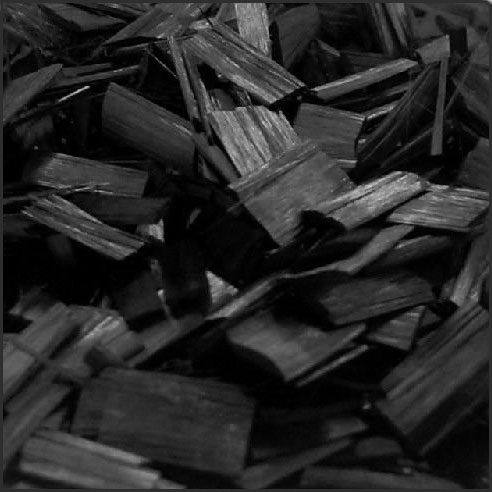
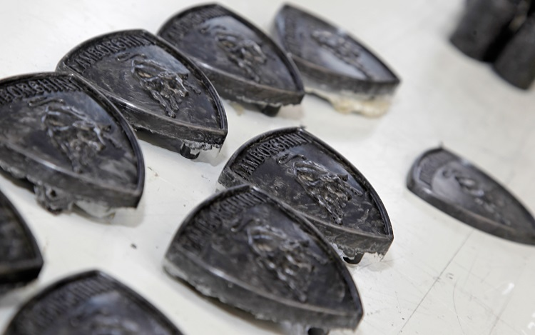
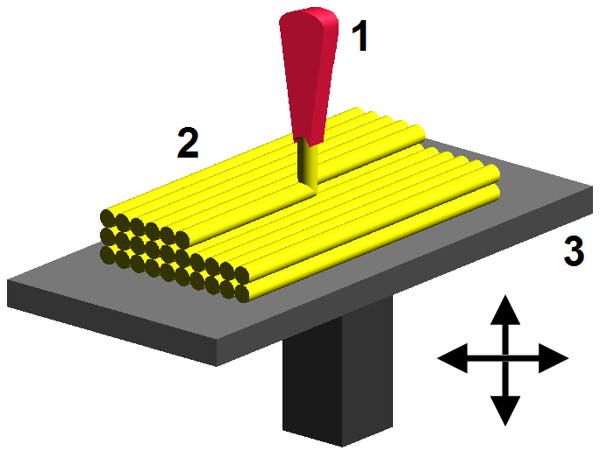

# AE831
## Continuum Mechanics
Lecture 1 - Tensors 
Dr. Nicholas Smith 
Wichita State University, Department of Aerospace Engineering

August 18, 2020

----

## schedule

- 18 Aug - Introduction, Tensors
- 20 Aug - Tensor Algebra
- 25 Aug - Tensor Calculus, HW1 Due
- 27 Aug - Material Derivative

----

## outline

<!-- vim-markdown-toc GFM -->

* introduction
* syllabus
* course overview
* index notation
* example

<!-- vim-markdown-toc -->

---

# introduction

----

## family

 <!-- .element width="30%" -->

----

## education

- B.S. in Mechanical Engineering from Brigham Young University
  - Worked with ATK to develop tab-less gripping system for tensile testing composite tow specimens
  - Needed to align the specimen, as well as grip it without causing a stress concentration

----

## education

- M.S. and Ph.D. from School of Aeronautics and Astronautics at Purdue University
  - Worked with Boeing to simulate mold flows
  - First ever mold simulation with anisotropic viscosity

----

## research

----

## research

----

## research

-  Composites are being used in 3D printing now 
-  Printing patterns are optimized for isotropic materials 
-  Sometimes composites hurt more than they help when not utilized properly 

----

## introductions

- Name
- Student status (Undergrad, Masters, Ph.D)
- Full time or part time student?
- One interesting thing to remember you by
- What are you hoping to learn in Continuum Mechanics?

---

# syllabus

----

## course textbook

- The textbook used in this class is: *Introduction to Continuum Mechanics*, W. Lai, 4th Ed.
- Homework problems will be posted on Blackboard, so other textbook editions may be used
- For additional reference in continuum mechanics, see
  - A.J.M. Spencer, *Continuum Mechanics*
  - G.E. Mase, *Schaum's Outline of Continuum Mechanics*
  - Y.C. Fung, *A First Course in Continuum Mechanics*

----

## office hours

- I will e-mail everyone in the course a Doodle link we can use to find the optimal office hours
- Let me know if you do not receive the e-mail, you may need to update your information in Blackboard
- Take advantage of office hours, this is time that I have already set aside for you
- If the regular office hours do not work for your schedule, send me an e-mail and we can work out a time to meet
- While in person visits are often the most helpful, I will always try to answer questions as best as I can via e-mail

----

## tentative course outline

- Tensors, Deformation, and Strain
  - Tensor Algebra (18 Aug )
  - Tensor Calculus (25 Aug)
  - Kinematics (3 Sep)
  - Exam 1 (15 Sep)

----

## tentative course outline

- Behavior of Solids
  - Stress (22 Sep)
  - Linear Elasticity (29 Sep)
  - Airy Stress Functions (6 Oct)
  - Anisotropy (13 Oct)
  - Large Deformation (20 Oct)
  - Exam 2 (27 Oct)

----

## tentative course outline

- Fluids and viscous solids
  - Newtonian Fluids (3 Nov)
  - Non-Newtonian Fluids (10 Nov)
  - Viscoelasticity (17 Nov)

----
## grades

-   Grade breakdown
  -   Homework 10%
  -   Exam 1 20%
  -   Exam 2 20%
  -   Final Exam 30%
  -   Research Project 20%

----

## grades

-   Follow a traditional grading scale
-   (80% B-, 83% B, 87% B+, etc.)

----

## curve

-   I do NOT curve final grades
-   Instead, each individual exam is curved on a best-fit linear scale
-   This scale is somewhat subjective, best score is mapped to 100, I pick one other score to map that I feel is representative of a C or a B
-   The end goal of this curve is to get a standard deviation close to 10% and a class average representative of the performance on the exam, usually between a C and a B

----
## class expectations

- Consider the cost (to you or others) of your being in class
- I ask that you refrain from distracting behaviors during class
- When you have something more important than class to take care of, please take care of it outside of class

----
## academic honesty

- While you are welcome to participate in study groups, every student must submit their own work
- As an example, every student should create their own Excel spreadsheet or MATLAB code for a problem, using a group spreadsheet with slight modifications is not acceptable
- All parties involved homework cheating will receive a zero for the assignment for a first offense
- Cheating on exams and repeat offenses will be handled on a case-by-case basis, but can lead to a failing grade in the course and expulsion from the university

----

## self-grade 

-   Your homework will be self-graded, your self-grading will generally be due the week after the original assignment
-   Homework solutions will be posted to Blackboard, and the remaining half of the homework credit will be assigned after you complete (and submit) your self-grade.
-   You do not lose credit for incorrect answers, but your self-grade should explain the differences between your answer and the correct solution.
-   Some problems will be somewhat open-ended and there may not be a "correct" answer, so consider that when looking at what is different between your solution and mine

---

# course overview

----
## what is continuum mechanics

- Study of the response of materials to different loading conditions
- Previous courses (mechanics of materials, theory of elasticity) focus on special cases (2D problems, small deformation, linear elastic materials, isotropy)
- In this course we will consider more general cases, such as large deformation, anisotropy, fluid response, and viscoelastic materials

---
# index notation

----
## index notation

- Consider the following
`$$s = a_1x_1 + a_2x_2 + ... + a_nx_n$$`

- Which we could also write as
`$$s = \sum_{i=1}^{n}a_ix_i$$`

- Using index notation, and Einstein's summation convention, we
  can also write this as
`$$s = a_ix_i$$`

----
## dummy index

- In index notation, a repeated index implies summation
- This index is also referred to as a dummy index
- It is called a "dummy index" because the expression would have the same meaning with any index in its place
- i.e. `$i$`, `$j$`, `$k$`, etc. would all have the same meaning when repeated
- Note, no index may be repeated more than once, thus the expression
  `$$s = \sum_{i=1}^{n}a_ib_ix_i$$` could not be directly written in index notation

----
## free index

- Any index which is not repeated in an index notation expression is
  referred to as a free index
- The number of free indexes in an expression indicate the tensor
  order of that expression
- No free indexes = scalar expression (0-order tensor)
- One free index = vector expression (1st-order tensor)
- Two free indexes = matrix expression (2nd-order tensor)

----
## index notation

  
- Free Index
  - Free index is not repeated (on any term)
  - Free index takes all values (1,2,3)
  - e.g. `$u_i = \langle u_1, u_2, u_3 \rangle$`
  - Free indexes must match across terms in an expression or equation

 

- Dummy Index
  - Dummy index is repeated on at least one term
  - Dummy index indicates summation over all values
  - e.g. `$\sigma_{ii} = \sigma_{11} + \sigma_{22} + \sigma_{33}$`
  - Index can not be used more than twice in the same term (`$A_{ij}B_{jk}C_{kl}$` is good, `$A_{ij}B_{ij}C_{ij}$` is not)

----
## dummy index

- The dummy index can be triggered by any repeated index in a **term**
- Summation or not?
  - `$a_i + b_{ij}c_j$` <!-- .element class="fragment" -->
  - `$a_{ij} + b_{ij}$` <!-- .element class="fragment" -->
  - `$a_{ij} + b_{ij}c_j$` <!-- .element class="fragment" -->

----
## matrix multiplication

- How can we write matrix multiplication in index notation?
 
`$$\begin{bmatrix}
  a_{11} & a_{12} \\
  a_{21} & a_{22}
  \end{bmatrix}
  \begin{bmatrix}
  b_{11} & b_{12} \\
  b_{21} & b_{22}
  \end{bmatrix} =
  \begin{bmatrix}
  c_{11} & c_{12} \\
  c_{21} & c_{22}
\end{bmatrix}$$`

- `$c_{11} = a_{11} b_{11} + a_{12} b_{21}$` <!-- .element class="fragment" -->
- `$ck{12} = a_{11} b_{21} + a_{12} b_{22}$` <!-- .element class="fragment" -->

----
## special symbols

- For convenience we define two symbols in index notation
- *Kronecker delta* is a general tensor form of the Identity Matrix
 
`$$\delta_{ij} = \left\{
  \begin{array}{ll}
  1& \text{if $i=j$}\\
  0& \text{otherwise}
  \end{array}
  \right. = \begin{bmatrix}
  1 & 0 & 0\\
  0 & 1 & 0 \\
  0 & 0 & 1
\end{bmatrix}$$`

- Is also used for higher order tensors
- `$\delta_{ij} = \delta_{ji}$`
- `$\delta_{ii} =$` `$3$`
- `$\delta_{ij}a_j =$` `$a_i$`
- `$\delta_{ij}a_{ij} =$` `$a_{ii}$`

----
## special symbols

- *alternating symbol* or *permutation symbol*
`$$\epsilon_{ijk} = \left\{
\begin{array}{rl}
  1 & \text{if $ijk$ is an even permutation of 1,2,3}\\
  -1 & \text{if $ijk$ is an odd permutation of 1,2,3}\\
  0 & \text{otherwise}
  \end{array}
\right.$$`

- This symbol is not used as frequently as the *Kronecker delta*
- For our uses in this course, it is enough to know that 123, 231, and 312 are even permutations
- 321, 132, 213 are odd permutations
- all other indexes are zero
- `$\epsilon_{ijk} \epsilon_{imn} = \delta_{jm} \delta_{kn} - \delta_{jn} \delta_{mk}$`

----
## substitution

- When solving tensor equations, we often need to manipulate expressions
- We need to make sure the correct indexes are used when substituting, for example
 
`$$a_i = U_{im} b_m
\label{eq:first}$$`

`$$b_i = V_{im} c_m
\label{eq:second}$$`

- To substitute \eqref{eq:second} into \eqref{eq:first}, we first need to change indexes

----
## substitution

  - We need to change the free index, `$i$`, to `$m$` in
    ([`$$eq:second$$`](#eq:second))

  - Since `$m$` is already used as the dummy index, we need to change
    that too

  - `$$\label{eq:seconda}
            b_m = V_{mj} c_j$$`

  - We can now make the substitution

  - `$$\label{eq:subbed}
            a_i = U_{im} V_{mj} c_j$$`

----
## multiplication

  - We need to be careful with indexes when multiplying expressions

  - `$$p = a_m b_m \qquad \text{and} \qquad q = c_m d_m$$`

  - We can express, `$pq$`, but remember the dummy index cannot be
    repeated more than once

  - `$$pq \ne a_m b_m c_m d_m$$`

  - Instead we must change the dummy index in one of the expressions
    first

  - `$$pq = a_m b_m c_n d_n$$`

----
## factoring

  - In the following expression, we would like to factor out `$n$`, but
    it has different indexes

  - `$$T_{ij}n_j - \lambda n_i =0$$`

  - Recall `$\delta_{ij}a_j = a_i$`, we can rewrite
    `$n_i = \delta_{ij} n_j$`

  - `$$T_{ij}n_j - \lambda \delta_{ij} n_j =0$$`

  - `$$(T_{ij} - \lambda \delta_{ij}) n_j =0$$`

----
## contraction

  - `$T_{ii}$` is the contraction of `$T_{ij}$`

  - This can often be a useful tool in solving tensor equations

  - `$$T_{ij} = \lambda \Delta \delta_{ij} + 2\mu E_{ij}$$`

  - `$$T_{ii} = \lambda \Delta \delta_{ii} + 2\mu E_{ii}$$`

----
## partial derivative

  - We indicate (partial) derivatives using a comma

  - In three dimensions, we take the partial derivative with respect to
    each variable (`$x,y,z$` or `$x_1,x_2,x_3$`)

  - For example a scalar property, such as density, can have a different
    value at any point in space

  - `$\rho = \rho(x_1, x_2, x_3)$`
    `$$\rho_{,i} = \frac{\partial}{\partial x_i} \rho = \left\langle \frac{\partial \rho }{\partial x_1}, \frac{\partial \rho }{\partial x_2}, \frac{\partial \rho }{\partial x_3} \right\rangle$$`

----
## partial derivative

  - Similarly, if we take the partial derivative of a vector, it
    produces a matrix
    `$$u_{i,j} = \frac{\partial}{\partial x_j} u_i = \begin{bmatrix}
            \frac{\partial u_1}{\partial x_1} & \frac{\partial u_1}{\partial x_2} & \frac{\partial u_1}{\partial x_3}\\
            \frac{\partial u_2}{\partial x_1} & \frac{\partial u_2}{\partial x_2} & \frac{\partial u_2}{\partial x_3}\\
            \frac{\partial u_3}{\partial x_1} & \frac{\partial u_3}{\partial x_2} & \frac{\partial u_3}{\partial x_3}
            \end{bmatrix}$$`

# example

----
## example

  - Solve the equation below for `$U_k$` in terms of `$P_i$` and
    `$a_i$`.
    `$$\mu \left[ \delta_{kj} a_i a_i + \frac{1}{1-2\nu} a_k a_j \right] U_k = P_j$$`

  - Multiply both sides by `$a_j$`
    `$$\mu \left[ a_j \delta_{kj} a_i a_i + \frac{1}{1-2\nu} a_k a_j a_j \right] U_k = P_j a_j$$`

  - The dummy indexes can be changed
    `$$\mu \left[ a_j \delta_{kj} a_i a_i + \frac{1}{1-2\nu} a_k a_i a_i \right] U_k = P_j a_j$$`

----
## example

  - `$a_j \delta_{kj} = a_k$`
    `$$\mu U_k \left[ a_k a_i a_i + \frac{1}{1-2\nu} a_k a_i a_i \right] = P_j a_j$$`

  - Factoring
    `$$\mu U_k a_k a_i a_i \left[ 1 + \frac{1}{1-2\nu} \right] = P_j a_j$$`

  - Simplifying
    `$$\mu U_k a_k a_i a_i \left[ \frac{2(1-\nu)}{1-2\nu} \right] = P_j a_j$$`

----
## example

  - Solve for `$U_k a_k$`
    `$$U_k a_k = \frac{P_j a_j(1-2\nu)}{2\mu a_i a_i (1-\nu) }$$`

  - This is a scalar equation, we need to find `$U_j$`, but we
    substitute this back into the original equation.

  - First, expand the original equation
    `$$\mu U_k \delta_{kj} a_i a_i + \mu U_k \frac{1}{1-2\nu} a_k a_j = P_j$$`

----
## example

  - After substitution, we find
    `$$\mu U_j a_i a_i + \mu \frac{1}{1-2\nu} \frac{P_j a_j(1-2\nu)}{2\mu a_i a_i (1-\nu) } a_j = P_j$$`

  - The index `$j$` is repeated too many times, so we need to change
    `$P_j a_j$` to a different index
    `$$\mu U_j a_i a_i + \frac{P_k a_k}{2 a_i a_i (1-\nu) } a_j = P_j$$`

  - We can now solve for `$U_j$`
    `$$U_j  = \frac{1}{\mu a_i a_i} \left[P_j - \frac{P_k a_k}{2 a_i a_i (1-\nu) } a_j\right]$$`
