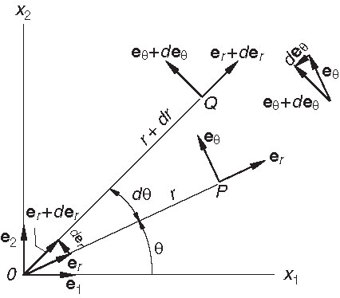
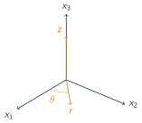
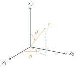

# AE831
## Continuum Mechanics
Lecture 3 - Tensor Calculus 
Dr. Nicholas Smith 
Wichita State University, Department of Aerospace Engineering

August 25, 2020

----

## schedule

- 25 Aug - Tensor Calculus, HW1 Due
- 27 Aug - Material Derivative
- 1 Sep - Conservation and Compatibility, HW2 Due
- 3 Sep - Polar Decomposition

----
## outline

<!-- vim-markdown-toc GFM -->

* tensor calculus
* other coordinate systems
* examples
* tensor review

<!-- vim-markdown-toc -->

----
## dyadic notation

- There is an antiquated notation that you may encounter reading older papers and texts
- Now known as "dyadic notation" (or sometimes "tensor product notation")
- Dyadic product: `\(C_{ij} = a_i b_j\)` is written as
`\(C = a \otimes b\)`
- Double dot product: `\(A_{ij} B_{ji} = c\)` is written as
`\(A : B = c\)`

---
# tensor calculus

----
## tensor valued functions

- If we consider some scalar variable, such as time, `\(t\)`
- A tensor function can be a function of this scalar variable,
`\(T_{ij}(t)\)`
- The formal definition for the derivative of `\(T_{ij}\)` with respect to `\(t\)` is
`\[\frac{dT_{ij}}{dt} = \lim_{\Delta t \to t} \frac{T_{ij}(t + \Delta t)-T_{ij}(t)}{\Delta t}\]`
- In this case, all the rules apply, such as the chain rule

----
## scalar fields

- A scalar-valued function of a position vector is known as a scalar field
- Density, temperature, electric potential are all examples of scalar fields
- The gradient, `\(\nabla\)`, of a scalar field, \(\phi\) is defined as
`\[\nabla \phi = \frac{\partial \phi}{\partial x_i} = \langle \frac{\partial \phi}{\partial x_1}, \frac{\partial \phi}{\partial x_2}, \frac{\partial \phi}{\partial x_3} \rangle\]`

----
## directional derivative

- The gradient can be used to find the directional derivative, or the rate of change of `\(\phi\)` in a certain direction
- If `\(r_i\)` is a vector in a direction, then the directional derivative of the scalar field `\(\phi\)` in the `\(r_i\)` direction is
`\[\nabla \phi \cdot r = \phi_{,i} r_i\]`
- The vector produced by the gradient will be perpendicular to a
  surface of constant `\(\phi\)`

----
## vector fields

- A vector-valued function of a position vector is known as a vector field
- Velocity and displacement are common examples of vector fields
- The gradient of a vector field is a second-order tensor
`\[\nabla v_i = v_{i_,j} = \begin{bmatrix}
	\frac{\partial v_1}{\partial x_1} & \frac{\partial v_1}{\partial x_2} & \frac{\partial v_1}{\partial x_3}\\
	\frac{\partial v_2}{\partial x_1} & \frac{\partial v_2}{\partial x_2} & \frac{\partial v_2}{\partial x_3}\\
	\frac{\partial v_3}{\partial x_1} & \frac{\partial v_3}{\partial x_2} & \frac{\partial v_3}{\partial x_3}
\end{bmatrix}\]`

----
## divergence and curl

- The divergence of a vector field is a scalar
`\[\text{div} (v) = \text{tr} (\nabla v) = \frac{\partial v_i}{\partial x_i}\]`
- We can also find the divergence of a tensor field, for a second-order tensor we find
`\[\text{div} (T) = \frac{\partial T_{ij}}{\partial x_i}\]`
- The curl is defined as two times the dual vector of the antisymmetric portion of `\(\nabla v\)`
`\[\text{curl}(v) = 2t^A = -\epsilon_{ijk}v_{j,k}\]`

----
## laplacian

- The Laplacian of a scalar field is defined as
`\[\nabla^2 f = \text{div} (\nabla f)\]`

- Which in rectangular coordinates is
`\[\nabla^2 f = f_{i,i} = \frac{\partial^2 f}{\partial x_1^2} + \frac{\partial^2 f}{\partial x_2^2} + \frac{\partial^2 f}{\partial x_3^2}\]`

----
## laplacian

- The Laplacian of a vector field is defined as
`\[\nabla^2 v = \nabla (\text{div} (v)) - \text{curl}(\text{curl}(v))\]`

- Which in rectangular coordinates is `\[\nabla^2 v = v_{i,jj}\]`

---
# other coordinate systems

----
## other coordinate systems

- Many times it is beneficial to use another coordinate system

- Certain geometries and symmetries can be handled much more easily in polar coordinates, cylindrical coordinates, or spherical coordinates

- Let us first consider the 2D case, polar coordinates

----
## polar coordinates

- We can readily see that

`\[\begin{aligned}
	e_r &= \langle \cos \theta, \sin \theta \rangle\\
	e_\theta &= \langle -\sin \theta, \cos \theta \rangle
\end{aligned}\]`

----
## polar coordinates

- We see that as the angle `\(\theta\)` changes, so do the polar coordinate unit base vectors

`\[\begin{aligned}
	d e_r &= \langle -\sin \theta, \cos \theta \rangle = d\theta e_\theta\\
	de_\theta &= \langle -\cos \theta, -\sin \theta \rangle  = -d\theta e_r
\end{aligned}\]`

----
## polar coordinates

- We can now find the components of `\(\nabla f\)`, `\(\nabla v_i\)`, `\(\text{div} (v_i)\)`, `\(\text{div} (T_{ij})\)`, `\(\nabla^2f\)` and `\(\nabla^2 v_i\)`.
`\[\nabla f = \langle f_{,r}, \frac{1}{r}f_{,\theta} \rangle\]`

`\[= \begin{bmatrix}
	v_{r,r} & \frac{1}{r}(v_{r,\theta}-v_\theta)\\
	v_{\theta,r} & \frac{1}{r}(v_{\theta,\theta}-v_r)
\end{bmatrix}\]`

`\[\text{div} (v_i) = \text{tr} (\nabla v_i) = v_{r,r} +\frac{1}{r}(v_{\theta,\theta}+v_r)\]`

----
## polar coordinates

`\[\text{curl} (v_i) = \langle 0, 0, v_{\theta,r} + \frac{v_\theta}{r} - \frac{1}{r}v_{r,\theta} \rangle\]`

`\[\text{div} (T_{ij}) = \langle T_{rr,r} + \frac{1}{r}T_{r\theta,\theta} + \frac{T_{rr}-T_{\theta\theta}}{r}, T_{r\theta,r} + \frac{1}{r} T_{\theta\theta,\theta} + \frac{T_{r\theta} + T_{\theta r}}{r} \rangle\]`

`\[\nabla^2 f = f_{,rr} + \frac{1}{r^2} f_{,\theta\theta} + \frac{1}{r}f_{,r}\]`

`\[\begin{aligned}
	\nabla^2 v_i =& \langle v_{r,rr} + \frac{1}{r^2}v_{r,\theta\theta} + v_{r,zz} + \frac{1}{r}v_{r,r} - \frac{2}{r^2}v_{\theta,\theta}-\frac{v_r}{r^2},\\
	& v_{\theta,rr} + \frac{1}{r^2}v_{\theta,\theta\theta} + \frac{1}{r}v_{\theta,r} + \frac{2}{r^2}v_{r,\theta}- \frac{v_\theta}{r^2}\rangle
\end{aligned}\]`

----
## cylindrical coordinates

 <!-- .element width="50%" -->

----
## cylindrical coordinates

- Calculus in cylindrical coordinates is nearly identical to polar coordinates

`\[\nabla f = \langle f_{,r}, \frac{1}{r}f_{,\theta}, f_{,z} \rangle\]`

`\[= \begin{bmatrix}
	v_{r,r} & \frac{1}{r}(v_{r,\theta}-v_\theta) & v_{r,z}\\
	v_{\theta,r} & \frac{1}{r}(v_{\theta,\theta}+v_r) & v_{\theta,z}\\
	v_{z,r} & \frac{v_{z,\theta}}{r} & v_{z,z}
\end{bmatrix}\]`

`\[\text{div} (v_i) = \text{tr} (\nabla v_i) = v_{r,r} +\frac{1}{r}(v_{\theta,\theta}+v_r) + v_{z,z}\]`

----
## cylindrical coordinates

`\[\begin{aligned}
	\text{curl} (v_i) = \langle &\frac{v_{z,\theta}}{r} - v_{\theta,z},\\
	& v_{r,z} - v_{z,r},\\
	& v_{\theta,r} + \frac{v_\theta}{r} - \frac{v_{r,\theta}}{r} \rangle
\end{aligned}\]`

`\[\begin{aligned}
	\text{div} (T_{ij}) = \langle &T_{rr,r} + \frac{T_{r\theta,\theta}}{r} + \frac{T_{rr}-T_{\theta\theta}}{r} + T_{rz,z},\\
	&T_{r\theta,r} + \frac{T_{\theta\theta,\theta}}{r}  + \frac{T_{r\theta} + T_{\theta r}}{r} + T_{\theta z, z},\\
	&T_{zr,r} + \frac{T_{z\theta,\theta}}{r} + T_{zz,z} + T_{zr,r}\rangle
\end{aligned}\]`

`\[\nabla^2 f = f_{,rr} + \frac{1}{r^2} f_{,\theta\theta} + \frac{1}{r}f_{,r} + f_{,zz}\]`

----
## cylindrical coordinates

`\[\begin{aligned}
	\nabla^2 v_i =& \langle v_{r,rr} + \frac{1}{r^2}v_{r,\theta\theta} + v_{r,zz} + \frac{1}{r}v_{r,r} - \frac{2}{r^2}v_{\theta,\theta}-\frac{v_r}{r^2},\\
	& v_{\theta,rr} + \frac{1}{r^2}v_{\theta,\theta\theta} + v_{\theta,zz} + \frac{1}{r}v_{\theta,r} + \frac{2}{r^2}v_{r,\theta}- \frac{v_\theta}{r^2},\\
	& v_{z,rr} + \frac{v_{z,\theta\theta}}{r^2} + \frac{v_{z,r}}{r} + v_{z,zz}\rangle
\end{aligned}\]`

----
## spherical coordinates

 <!-- .element width="50%" -->

----
## spherical coordinates

- For calculus in spherical coordinates, we have
`\[\nabla f = \langle f_{,r}, \frac{f_{,\theta}}{r}, \frac{f_{,\phi}}{r \sin \theta} \rangle\]`

`\[\nabla v_i = \begin{bmatrix}
	v_{r,r} & \frac{v_{r,\theta}-v_\theta}{r} & \frac{v_{r,\phi}}{r \sin \theta} - \frac{v_\phi}{r}\\
	v_{\theta,r} & \frac{v_{\theta,\theta}+v_r}{r} & \frac{v_{\theta,\phi}}{r \sin \theta} - \frac{v_\phi \cot \theta}{r}\\
	v_{\phi,r} & \frac{v_{\phi,\theta}}{r} & \frac{v_{\phi,\phi}}{r\sin \theta} + \frac{v_r + v_\theta \cot \theta}{r}
\end{bmatrix}\]`

`\[\text{div} ( v_i) = \frac{(r^2v_r)_{,r}}{r^2} + \frac{(v_\theta \sin \theta)_{,\theta}}{r\sin \theta} + \frac{v_{\phi,\phi}}{r\sin\theta}\]`

----
## spherical coordinates

`\[\text{curl} (v_i) = \langle \frac{v_\phi cot\theta+v_{\phi,\theta}}{r} - \frac{v_{\theta,\phi}}{r \sin \theta}, \frac{v_{r,\phi}}{r\sin\theta} - \frac{(rv_{\phi})_{,r}}{r}, \frac{(rv_\theta)_{,r}-v_{r,\theta}}{r} \rangle\]`

`\[\text{div}(T_{ij}) = \begin{aligned}\langle
	& \frac{(r^2T_{rr})_{,r}}{r^2} + \frac{(T_{r\theta}\sin\theta)_{,\theta}+T_{r\phi,\phi}}{r\sin\theta} - \frac{T_{\theta\theta} + T_{\phi\phi}}{r}\\
	& \frac{(r^3T_{\theta r})_{,r}}{r^3} + \frac{(T_{\theta\theta}\sin\theta)_{,\theta}+T_{\theta\phi,\phi}}{r\sin\theta} + \frac{T_{r\theta} - T_{\theta r}- T_{\phi\phi}\cot\theta}{r}\\
	& \frac{(r^3T_{\phi r})_{,r}}{r^3} + \frac{(T_{\phi\theta}\sin\theta)_{,\theta}+T_{\phi\phi,\phi}}{r\sin\theta} + \frac{T_{r\phi} - T_{\phi r}+ T_{\theta\phi}\cot\theta}{r}
\rangle\end{aligned}\]`

----
## spherical coordinates

`\[\nabla^2 f = f_{,rr} + \frac{2 f_{,r}}{r} + \frac{f_{,\theta\theta}+ f_{,\theta}\cot \theta}{r^2} + \frac{f_{,\phi \phi}}{r^2\sin^2\theta}\]`

`\[\nabla^2 v_i = \begin{aligned}
	\langle & \frac{(r^2v_r)_{,rr}+v_{r,\theta\theta} + v_{r,\theta}\cot \theta}{r^2} - \frac{2(r^2v_r)_{,r}}{r^3} + \frac{v_{r,\phi \phi}}{r^2\sin^2\theta} \\
	&\qquad - \frac{2(v_\theta \sin \theta)_{,\theta} + 2v_{\phi,\phi}}{r^2 \sin \theta}\\
	&\frac{(r^2 v_{\theta,r})_{,r} \left(\frac{(v_{\theta}\sin\theta)_{,\theta}}{\sin \theta}\right)_{,\theta} + 2v_{r,\theta}}{r^2} + \frac{v_{\theta,\phi\phi}}{r^2\sin^2\theta} - \frac{2 \cot \theta v_{\phi,\phi}}{r^2 \sin\theta}\\
	&\frac{(r^2 v_{\phi,r})_{,r} \left(\frac{(v_{\phi}\sin\theta)_{,\theta}}{\sin \theta}\right)_{,\theta}}{r^2} + \frac{v_{\phi,\phi\phi}}{r^2\sin^2\theta} + \frac{2v_{r,\phi} + 2 \cot \theta v_{\theta,\phi}}{r^2 \sin\theta}
\rangle \end{aligned}\]`

---
# examples

----
## spherical coordinates

- Calculate `\(\text{div}(u_i)\)` in spherical coordinates for the vector field

`\[u_i = \langle Ar + \frac{B}{r^2}, 0, 0 \rangle\]`

---
# tensor review

----
## group one

- Solve the following expression for `\(T_{ij}\)`
`\[E_{ij} = \frac{1}{2\mu} \left[T_{ij} - \frac{\lambda}{3\lambda + 2\mu} T_{kk} \delta_{ij}\right]\]`

- Hint: First solve for `\(T_{kk}\)`, and then substitute that result to complete the solution

----
## group two

- For the tensor `\(T_{ij}\)`, 
`\[T_{ji} = \begin{bmatrix}
  1& 5 & -5\\
  5 & 0 & 0\\
	-5 & 0 & 1
\end{bmatrix}\]` find `\(T_{11}^\prime\)` where `\(e_1^\prime = -e_2 + 2e_3\)` and \(e_2^\prime = e_1\)

- Hint: unless you have an advanced calculator, this problem will be easier in tensor notation, since you need only find one term of the transformed tensor (let `\(i=j=1\)`).

----
## group three

- Consider the ellipsoidal surface defined by `\[\frac{x^2}{a^2} + \frac{y^2}{b^2} + \frac{z^2}{b^2} = 1\]`

- Find the unit vector normal to the surface at some point, `\((x,y,z)\)`

----
## group four

- Calculate `\(\text{div}(u_i)\)` in cylindrical coordinates for the vector field
`\[u_i = \langle \frac{\sin \theta}{r}, 0, 0 \rangle\]`
