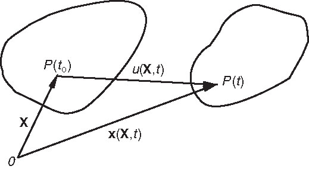
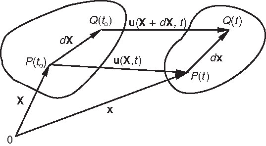

# AE831
## Continuum Mechanics
Lecture 4 - Material Derivative 
Dr. Nicholas Smith 
Wichita State University, Department of Aerospace Engineering

August 27, 2020

----
## schedule

- 27 Aug - Material Derivative
- 1 Sep - Conservation and Compatibility, HW2 Due
- 3 Sep - Polar Decomposition
- 8 Sep - Exam Review

----
## outline

<!-- vim-markdown-toc GFM -->

* motion of a continuum
* material derivative
* displacement field
* deformation

<!-- vim-markdown-toc -->

---
# motion of a continuum

----
## motion of a continuum

- For a particle we define the path as a function of time
`\[r_i = r_i(t) = \langle x_1(t), x_2(t), x_3(t) \rangle\]`

- For N particles there will be N path lines
- In a continuum, there are infinitely many particles

----
## motion of a continuum

- Instead of identifying particles by some identifying number, we identify them by their position
`\[x_i = x_i (X_1, X_2, X_3,t) \qquad \text{with} \qquad X_i = x_i (X_1, X_2, X_3, t_0)\]`

- `\((X_1,X_2,X_3)\)` are known as the material coordinates and are used to identify the different particles of a body, while equation 4.2 describes a motion

----
## motion of a continuum

- Sketch the motion described by
`\[x_i = X_i + kt \langle 2 X_1, X_2, 0 \rangle\]`

----
## material and spatial 

- Common properties that are functions of time in a continuum are temperature, `\(\Theta\)`, velocity, \(v\), and stress, \(T\)

- The material (lagrangian) description tracks particles, i.e.
`\[\begin{aligned}
	\Theta &= \hat{\Theta}(X_1, X_2, X_3,t)\\
	v &= \hat{v}(X_1, X_2, X_3,t)\\
	T &= \hat{T}(X_1, X_2, X_3,t)
\end{aligned}\]`

----
## material and spatial 

- The spatial description tracks these properties through fixed locations, i.e. 
`\[\begin{aligned}
	\Theta &= \tilde{\Theta}(x_1, x_2, x_3,t)\\
	v &= \tilde{v}(x_1, x_2, x_3,t)\\
	T &= \tilde{T}(x_1, x_2, x_3,t)
\end{aligned}\]`

----
## material and spatial 

- The motion of a continuum is defined as
`\[x_i = \langle X_1 + ktX_2, (1+kt)X_2, X_3 \rangle\]`

- The temperature field is defined as `\[\Theta = \alpha(x_1 + x_2)\]`
- Find the material description of the temperature field and find the velocity and rate of change of temperature (in both material and spatial descriptions)

---
# material derivative

----
## material derivative

- The time rate of change of some quantity of a material particle is known as the material derivative
- The material derivative is generally denoted as `\(D/Dt\)`
- When using the material (Lagrangian) description, the material derivative is simply
`\[\frac{D \Theta}{Dt} = \left(\frac{\partial \hat{\Theta}}{\partial t}\right)_{X_i-fixed}\]`

----
## material derivative

- For the spatial description, however, `\(x_i\)` are not constant for a given material with fixed `\(X_i\)`, hence
`\[\frac{D \Theta}{Dt} = \left(\frac{D \tilde{\Theta}}{Dt}\right)_{X_i-fixed} = \left(\frac{\partial \tilde{\Theta}}{\partial x_i}\right)\frac{\partial x_i}{\partial t} + \left(\frac{\partial \tilde{\Theta}}{\partial t}\right)_{x_i-fixed}\]`

----
## material derivative

- Since `\(\frac{\partial x_i}{\partial t}\)` for fixed `\(X_i\)` are the velocity components of a given particle, we can also write
`\[\frac{D \Theta}{Dt} = \left(\frac{D \tilde{\Theta}}{Dt}\right)_{X_i-fixed} = \frac{\partial \tilde{\Theta}}{\partial t} + v_i \tilde{\Theta}_{,i}\]`

----
## material derivative

- The above equations are valid only for a Cartesian coordinate system
- A more general definition is
`\[\frac{D \Theta}{Dt} = \left(\frac{D \tilde{\Theta}}{Dt}\right)_{X_i-fixed} = \frac{\partial \tilde{\Theta}}{\partial t} + v_i \cdot \nabla \tilde{\Theta}\]`

----
## material derivative

- Find the material derivative, `\(D\Theta/Dt\)` for the temperature field in the previous example

----
## acceleration of a particle

- The acceleration of a particle is the material derivative of the
  velocity of a particle
`\[a_i = \frac{D v_i}{Dt}\]`

----
## acceleration of a particle

- If we know the material description of a particle's velocity, this calculation is simple

- If we only know the spatial description of velocity, we must use (4.15)
`\[a_i = \frac{\partial \tilde{v_i}}{\partial t} + v_i \cdot \nabla \tilde{v_i}\]`

----
## acceleration of a particle

- A particle is rotating with angular velocity
`\(\omega_i = \langle 0, 0, \omega \rangle\)`

- Find the velocity field
- Use the velocity field to find the acceleration field

---
# displacement field

----
## displacement field

- The displacement vector for a particle in a continuum is defined as the vector from the reference position to the current position
`\[u_i(X_i,t) = x_i(X_i,t) - X_i\]`

----
## rigid body motion

- Rigid translation is given by `\[x_i = X_i + c_i(t)\]`
- Rigid rotation about a fixed point is given by
`\[x_i - b_i = R_{ij}(t)(X_j -b_j)\]` Where `\(R_{ij}(t)\)` is a proper orthogonal (rotation) tensor

----
## rigid body motion

- When the rigid rotation is about the origin we have
`\[x_i = R_{ij}(t)X_j\]`

- General rigid body motion can include both translation and rotation
`\[x_i = R_{ij}(t) (X_j-b_j) + c_i(t)\]`

----
## rigid body motion 

Derive the relation between the velocity of a material point with the angular velocity of the body and velocity of the chosen point.

---
# deformation

----
## infinitesimal deformation

 

 

- We recall `\(P\)`, which undergoes some displacement, `\(u\)`
- A neighboring point, `\(Q\)`, at `\(X_i + dX_i\)` arrives at
`\(x_i + dx_i\)`
`\[x_i + dx_i = X_i + dX_i + u_i(X_i + dX_i, t)\]`

----
## infinitesimal deformation

 <!-- .element width="40%" -->

 <!-- .element width="60%" -->

- Subtracting `\(dx_i\)` and using the definition of the gradient of a vector function, we have `\[dx_i = dX_i + u_{i,j} dX_j\]`

----
## infinitesimal deformation

- We can re-write (4.24) 
`\[\begin{aligned}
	dx_i &= dX_i + u_{i,j} dX_j\\
	dx_i &= dX_j \delta_{ij} + u_{i,j} dX_j\\
	dx_i &= (u_{i,j} + \delta_{ij}) dX_j
\end{aligned}\]`

- We define the deformation gradient, `\(F\)` as
`\(F = u_{i,j} +  \delta_{ij}\)`

----
## infinitesimal deformation

- We can find some interesting information by finding the length of `\(dx_i\)` to the undeformed length of \(dX_i\)

`\[dx_i dx_i = F_{ij} dX_j F_{ik} dX_k\]`

- We can rearrange this to 
`\[dx_i dx_i =  dX_j F_{ij} F_{ik} dX_k\]`

----
## infinitesimal deformation

- We now define the right Cauchy-Green deformation tensor as `\(C_{jk} = F_{ij} F_{ik}\)`, and note that if `\(C_{jk} = \delta_{jk}\)`, then the deformed length is equal to the original length, corresponding to rigid body motion

----
## lagrange strain tensor

- We can break down the right Cauchy-Green deformation tensor to derive the Lagrange strain tensor
`\[\begin{gathered}
    C_{ij} = F_{ki} F_{kj} = F^TF = (I+\nabla u)^T(I+\nabla u) = \\
    \qquad I + \nabla u + (\nabla u)^T + (\nabla u)^T (\nabla u)
\end{gathered}\]`

----
## lagrange strain tensor

- We recall that `\(C = I\)` refers to rigid body motion, and thus define the Lagrange strain tensor as one-half of the deformation with no rigid body motion
`\[E^* = \frac{1}{2} \left[\nabla u + (\nabla u)^T + (\nabla u)^T (\nabla u)\right]\]`

----
## lagrange strain tensor

- The Lagrange strain tensor is a finite deformation tensor
- For infinitesimal deformations, we assume that `\((\nabla u)^T (\nabla u)\)` is negligible when compared with `\(\nabla u\)`
- In this case the Lagrange strain tensor would reduce to
`\[E = \frac{1}{2} \left[\nabla u + (\nabla u)^T\right]\]`

----
## lagrange strain tensor

- Which is simply the symmetric portion of `\(\nabla u\)`
- In rectangular coordinates, we have
`\[E_{ij} = \frac{1}{2} (u_{i,j} + u_{j,i})\]`

----
## physical meaning

- If we consider two elements, `\(dX_i^{(1)}\)` and `\(dX_i^{(2)}\)` 
- Due to motion they become `\(dx_i^{(1)}\)` and `\(dx_i^{(2)}\)`
- For small deformations, we know that 
`\[\begin{gathered}
    dx_i^{(1)} dx_i^{(2)} = F_{ij} dX_j^{(1)} F_{ik} dX_k^{(2)} = dX_j^{(1)} C_{jk} dX_k^{(2)} = \\
    \qquad dX_j^{(1)} (\delta_{jk} + 2E_{jk}) dX_k^{(2)}
\end{gathered}\]`

----
## physical meaning

- Which we can expand to
`\[dx_i^{(1)} dx_i^{(2)} = dX_i^{(1)}dX_i^{(2)} + 2E_{jk}dX_j^{(1)}dX_k^{(2)}\]`

----
## physical meaning

- If we look at the length of a single material element, `\(dX_i = dS dn_i\)` we find the deformed length, \(ds\) to be
`\[ds^2 = dS^2 + 2dS^2 (n_i E_{ij} n_j)\]`

- For small deformations, we make the assumption that
`\[ds^2 - dS^2 = (ds + dS)(ds - dS) \approx 2dS(ds-dS)\]`

----
## physical meaning

- Which leads to 
`\[\frac{ds - dS}{dS} = n_i E_{ij} n_j\]`

- This means that the diagonal terms of `\(E_{ij}\)` give the unit elongation for an element originally in the `\(1\)`, `\(2\)` or `\(3\)` directions

----
## physical meaning

- If we consider two unit vectors, `\(m_i\)` and `\(n_i\)` which are initially perpendicular, we have `\(dX_i^{(1)} = dS_1 m_i\)` and `\(dX_i^{(2)} = dS_2n_i\)`
- We can find the angle between the two deformed vectors, `\(dx_i^{(1)}\)` and \(dx_i^{(2)}\)
`\[dx_i^{(1)} dx_i^{(2)} = ds_1 ds_2 \cos \theta = 2E_{jk}dS_1 m_j dS_2 n_k\]`
- Since the angle between the vectors was originally `\(\pi/2\)`, we define the change in angle as `\(\gamma = \pi/2 - \theta\)`

----
## physical meaning

- We also note that `\(\cos \theta = \cos (\pi/2 - \gamma) = \sin \gamma\)`
- For small deformations (i.e. small `\(\gamma\)`) we have `\(\sin \gamma \approx \gamma\)` and `\(\frac{ds_1}{dS_1} \approx 1\)` and `\(\frac{ds_2}{dS_2} \approx 1\)`
- This gives 
`\[\gamma = 2 E_{ij} m_i n_j\]`

----
## physical meaning

- We can isolate off-diagonal terms in `\(E_{ij}\)` by letting `\(m_i = \langle 1, 0, 0 \rangle\)` and `\(n_j = \langle 0,1,0 \rangle\)` (and other perpendicular directions)
- This means that `\(2E_{12}\)` gives the change in angle between two elements initially in the `\(x_1\)` and `\(x_2\)` directions
