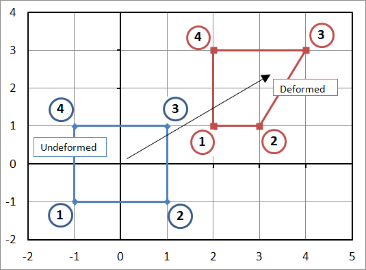

# AE831
## Continuum Mechanics
Lecture 6 - Polar Decomposition 
Dr. Nicholas Smith 
Wichita State University, Department of Aerospace Engineering

August 27, 2020

----
## schedule

- 3 Sep - Polar Decomposition
- 8 Sep - Exam Review, HW3 Due
- 10 Sep - Exam 1
- 15 Sep - Stress
- 17 Sep - Stress

----
## outline

---
# finite strain tensors

----
## lagrangian strain tensor

- Recall the Lagrangian strain tensor
`\[E^*_{ij} = \frac{1}{2}(C_{ij} - \delta_{ij})\]`

- Following the same development as done previously, we can find the physical meaning of the Lagrangian strain tensor 
`\[\begin{aligned}
	E_{11}^* &= \frac{ds_1^2 - dS_1^2}{2dS_1^2}\\
	2E_{12}^* &= \frac{ds_1 ds_2}{dS_1 dS_2} \cos (n_i, m_i)
\end{aligned}\]`

 - We can compare this to the infinitesimal strain tensor
 `\[\begin{aligned}
	E_{11} &= \frac{ds - dS}{dS}\\
 	2E_{12} &= \gamma
 \end{aligned}\]`

----
## lagrangian strain tensor

- We can also write the Lagrangian strain tensor in terms of displacement

- Recall that `\(C=F^TF\)` and `\(F = I + \nabla u\) `
`\[\begin{gathered}
	E^* = \frac{1}{2}(F^TF - I) = \frac{1}{2}\left[(I + \nabla u)^T(I + \nabla u) - I\right] = \\
	\frac{1}{2}\left[(\nabla u)^T \nabla u + \nabla u + (\nabla u)^T \right]
\end{gathered}\]`

----
## eulerian strain tensor

- The Eulerian strain tensor is defined as
`\[e^* = \frac{1}{2}(I - B^{-1})\]`

- Following the same procedure for identifying physical meaning, but using the inverse of `\(F_{ij}\)`, we find 
`\[\begin{aligned}
	e_{11}^* &= \frac{ds_1^2 - dS_1^2}{2ds_1^2}\\
	e_{12}^* &= -\frac{dS_1dS_2}{ds_1ds_2}\cos (n_i, m_i)
\end{aligned}\]`

----
## eulerian strain tensor

- If we express the eulerian strain tensor in terms of displacement, we find
`\[e^* = \frac{1}{2}\left[-(\nabla_x u)^T \nabla_x u + \nabla_x u + (\nabla_x u)^T \right]\]`

- Notice that for small deformations, `\(e^* \approx E^*\)`

----
## change in volume

- If we consider three material elements, `\(dX_i^{(1)} = dS_1 e_1\)`, `\(dX_i^{(2)} = dS_2 e_2\)` and `\(dX_i^{(3)} = dS_3 e_3\)` the volume in the reference configuration is given by 
`\[dV_0 = dS_1 dS_2 dS_3\]`

- After deformation, we find that 
`\[dV = dV_0 |\det F|\]`

- For convenience, `\(J = |\det F|\)` is often used

---
# finite elements

----
## finite element mapping

- Finite elements are often used to solve continuum mechanics problems

- It is helpful to know how important quantities, such as the deformation gradient, are calculated

- Reference on this topic can be found from the open source [continuum mechanics text](http://continuummechanics.org/finiteelementmapping.html)

----
## finite element mapping

----
## finite element mapping

- The equations to map this deformation are generally written as
`\[\begin{aligned}
	u(X,Y) &= \phi_1(X,Y) u_1 + \phi_2(X,Y) u_2 + \phi_3(X,Y) u_3 + \phi_4(X,Y) u_4\\
	v(X,Y) &= \phi_1(X,Y) v_1 + \phi_2(X,Y) v_2 + \phi_3(X,Y) v_3 + \phi_4(X,Y) v_4
\end{aligned}\]`

- Where `\(\phi_i\)` are the shape functions for each node in the element 
`\[\begin{aligned}
	\phi_1 &= \frac{1}{4}(1-X)(1-Y)\\
	\phi_2 &= \frac{1}{4}(1+X)(1-Y)\\
	\phi_3 &= \frac{1}{4}(1+X)(1+Y)\\
	\phi_4 &= \frac{1}{4}(1-X)(1+Y)\\
\end{aligned}\]`

----
## deformation gradients

- Recall that the deformation gradient in terms of displacement is
`\[F_{ij} = \delta_{ij} + u_{i,j}\]`

- We can readily calculate this for individual terms of the deformation gradient
