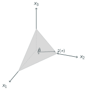

# AE831
## Continuum Mechanics
Lecture 7 - Stress 
Dr. Nicholas Smith 
Wichita State University, Department of Aerospace Engineering

15 September, 2020

----
## schedule

- 15 Sep - Stress
- 17 Sep - Stress

----
## outline

<!-- vim-markdown-toc GFM -->

* traction vector and stress tensor
* linear momentum and static equilibrium
* piola kirchoff stress tensors

<!-- vim-markdown-toc -->

---
# traction vector and stress tensor

----
## some words on notation

- This text uses a different notation from what is generally taught in elasticity, but the concepts are identical
- "stress vector" is equivalent to a "traction vector"
- The symbol `\(T\)` used for the stress tensor is equivalent to `\(\sigma\)` used for the stress tensor in Elasticity

----
## traction

----
## traction

- The traction vector is defined as
`\[\hat{t}^n(x,\hat{n}) = \lim\limits_{\Delta A \to 0} \frac{\Delta \hat{f}}{\Delta A}\]`

- By Newton's third law (action-reaction principle)
`\[\hat{t}^n(x,\hat{n}) = -\hat{t}^n(x,-\hat{n})\]`

----
## traction

----
## traction

- If we consider the special case where the normal vectors, `\(\hat{n}\)`, align with the coordinate system (`\(\hat{e}_1\)`,`\(\hat{e}_2\)`,`\(\hat{e}_3\))`
- On the 1-face: 
`\[\begin{aligned}
	\hat{n}&=\hat{e}_1: &\quad \hat{t}^n = t_i^{(\hat{e}_1)} \hat{e}_i = t_1^{(\hat{e}_1)} \hat{e}_1 + t_2^{(\hat{e}_1)} \hat{e}_2 + t_3^{(\hat{e}_1)} \hat{e}_3
\end{aligned}\]`

- On the 2-face: 
`\[\begin{aligned}
	\hat{n}&=\hat{e}_2: &\quad \hat{t}^n = t_i^{(\hat{e}_2)} \hat{e}_i = t_1^{(\hat{e}_2)} \hat{e}_1 + t_2^{(\hat{e}_2)} \hat{e}_2 + t_3^{(\hat{e}_2)} \hat{e}_3
\end{aligned}\]`

- And on the 3-face: 
`\[\begin{aligned}
	\hat{n}&=\hat{e}_3: &\quad \hat{t}^n = t_i^{(\hat{e}_3)} \hat{e}_i = t_1^{(\hat{e}_3)} \hat{e}_1 + t_2^{(\hat{e}_3)} \hat{e}_2 + t_3^{(\hat{e}_3)} \hat{e}_3
\end{aligned}\]`

----
## stress tensor

- To simplify the notation, we introduce the stress tensor
`\[\sigma_{ij} = t_j^{(\hat{e}_i)}\]`

----
## traction

- We can find some interesting information about the traction vector by considering an arbitrary tetrahedron with some traction `\(\hat{t}^{(n)}\)` applied to the surface

----
## traction

- If we consider the balance of forces in the `\(x_1\)`-direction
`\[t_1 dA - \sigma_{11} dA_1 - \sigma_{21} d A_2 - \sigma_{31} dA_3 + b_1 \rho dV = 0\]`

- The area components are: 
`\[\begin{aligned}
	dA_1 &= n_1 dA\\
	dA_2 &= n_2 dA\\
	dA_3 &= n_3 dA\\
\end{aligned}\]`

- And `\(dV = \frac{1}{3}h dA\)`.

----
## traction

`\[t_1 dA - \sigma_{11} n_1 dA - \sigma_{21} n_2 dA - \sigma_{31} n_3 dA + b_1 \rho \frac{1}{3}h dA = 0\]`

- If we let `\(h \to 0\)` and divide by `\(dA\)`
`\[t_1 = \sigma_{11} n_1 + \sigma_{21} n_2 + \sigma_{31} n_3\]`

- We can write this in index notation as 
`\[t_1 = \sigma_{i1} n_i\]`

- We find, similarly 
`\[\begin{aligned}
	t_2 &= \sigma_{i2} n_i\\
	t_3 &= \sigma_{i3} n_i\\
\end{aligned}\]`

----
## traction

- We can further combine these results in index notation as
`\[t_j = \sigma_{ij} n_i\]`

- This means with knowledge of the nine components of `\(\sigma_{ij}\)`, we can find the traction vector at any point on any surface

----
## example

- Consider a block of material with a uniformly distributed force acting on the 1-face. Find the tractions on an arbitrary interior plane

----
## example

- First we consider a vertical cut on the interior 1-face (`\(n_i=\langle 1, 0, 0 \rangle\)`)
- Next we represent the force `\(P\)` as a vector, `\(p_i = \langle P, 0, 0 \rangle\)`
- Balancing forces yields 
`\[t_i A - p_i = 0\]`

- We find `\(t_1 = \frac{P}{A} = \sigma_{11}\)`, `\(t_2 = 0 = \sigma_{12}\)` and `\(t_3 = 0 = \sigma_{13}\)`

- No force is applied in the other directions, so it is trivial to find the rest of the stress tensor 
`\[\sigma_{ij} = \begin{bmatrix}
	P/A & 0 & 0\\
	0 & 0 & 0\\
	0 & 0 & 0
\end{bmatrix}\]`

----
## example

- We can now consider any arbitrary angle of interior cut.
- The normal for a cut as shown in the diagram will be `\(n_i = \langle \cos \theta, \sin \theta, 0 \rangle\)`.
- We can again use `\(t_j = \sigma_{ij} n_i\)` to find `\(t_j\)` for any angle `\(\theta\)`. 
`\[\begin{aligned}
	t_1 &= \frac{P}{A} \cos \theta \\
	t_2 &= 0\\
	t_3 &= 0
\end{aligned}\]`

---
# linear momentum and static equilibrium

----
## linear momentum

- From the principle of linear momentum, we know that `\(F=ma\)`
- If we consider some internal body force, `\(B\)`, and use the knowledge that tractions on opposing faces must be equal, we find (in Cartesian coordinates) 
`\[T_{ij,j} + \rho B_i = \rho a_i\]`

- These are known as Cauchy's equations of motion
- For a body to be in static equilibrium `\(a_i = 0\)`

----
## static equilibrium

- Most of the time, we will deal with bodies which are not in motion, and can use the condition of static equilibrium
`\[T_{ij,j} + \rho B_i = 0\]`

- In some cases, the body forces (usually gravity) are negligible compared with other forces acting on a body
- In invariant form, we can write this as
`\[\text{div} T_{ij} + \rho B_i = \rho a_i\]` 

which is valid in any coordinate system

----
## example

- Is the following stress distribution in static equilibrium?
`\[T_{ij} = \begin{bmatrix}
	x_2^2 + \nu (x_1^2 - x_2^2) & -2\nu x_1 x_2 & 0\\
	-2\nu x_1 x_2 & x_1^2 + \nu (x_2^2 - x_1^2) &  0\\
	0 & 0 & \nu(x_1^2 + x_2^2)
\end{bmatrix}\]`

----
## boundary conditions

- In most problems, we don't know anything about the internal stress state, but we do know what is applied on the surface
- We apply these as traction boundary conditions, which can be used to find the internal stress tensor
- If a surface is "free" with no boundary or force constraints, it is a traction-free boundary condition

----
## example

- Suppose a cylinder has a variable density given by `\(\rho = r^2\)`
- Find the state of stress from gravity in these conditions

----
## example

- There is no traction along the outer surfaces
- Using Cauchy's stress theorem with the normal `\(n = \langle 1, 0, 0 \rangle\)` we can find 
`\[\begin{aligned}
	t_j &= \sigma_{ij} n_i\\
	&= \langle \sigma_{rr}n_r + \sigma_{r\theta} n_\theta + \sigma_{rz} n_z, \sigma_{\theta r}n_r + \sigma_{\theta \theta} n_\theta + \sigma_{\theta z} n_z, \sigma_{zr}n_r + \sigma_{z\theta} n_\theta + \sigma_{zz} n_z\rangle \\
	&= \langle \sigma_{rr}, \sigma_{\theta r}, \sigma_{z r} \rangle
\end{aligned}\]`

- And choosing another normal, we find
- `\(\sigma_{r} = \sigma_{r \theta} = \sigma_{\theta} = \sigma_{rz} = \sigma_{\theta_z} = 0\)`
- We can also find that `\(\sigma_z = 0\)` at the free surface

----
## example

- Since gravity only acts in the `\(z\)`-direction, we make the assumption that all stress functions be functions of `\(z\)` only
- To find the stress in the `\(z\)` direction, we use the third equilibrium equation
`\[\frac{\partial \tau_{r z}}{\partial r} + \frac{1}{r} \frac{\partial \tau_{\theta z}}{\partial \theta} + \frac{\partial \sigma_z}{\partial z} + \frac{1}{r}\tau_{rz} + \rho B_z = 0\]`

- We can substitute known values to find that
`\[\frac{\partial \sigma_z}{\partial z} + r^2 g = 0\]`

----
## example

- Since we desire to find the stress at any point, we introduce a variable to indicate the coordinate of our free body diagram cut

----
## example

- We integrate over this free body to find 
`\[\begin{aligned}
	\sigma_z &=  -\int_L^z r^2 g dz\\
	&= r^2 g (L-z)
\end{aligned}\]`

- In this case, the stress is a function of radial distance (just like the body force was)

---
# piola kirchoff stress tensors

----
## piola kirchoff stress tensors

- The Cauchy stress tensor is based on the differential area at the current position (deformed state)
- The first and second Piola Kirchoff stress tensors are based on the undeformed area
- Equations of motion can be formulated in either the deformed or un-deformed configuration, based on which is more convenient for a given problem
- For large deformation problems, whether the rate of deformation tensor `\(D_{ij}\)`, `\(D F_{ij}/ Dt\)` , or `\(D E_{ij}^*/Dt\)` is used facilitates the use of Cauchy or one of the Piola Kirchoff Stress tensors

----
## first piola kirchoff stress tensor

- For the first Piola Kirchoff stress tensor (also known as the Lagrangian stress tensor), we let 
`\[df_i = t^0_i dA^0\]`

- Note that `\(t^0_i\)` is a pseudo traction vector, and does not describe the actual intensity of `\(df_i\)`, which is acting on the deformed area
- Also note that since `\(df_i\)` is the acting on the deformed area, `\(t^0_i\)` acts in the same direction as `\(t_i\)`
- We can now formulate the stress tensor in the same way as the Cauchy stress tensor 
`\[t^0_i = T^0_{ij}n^0_j\]`

----
## first piola kirchoff stress tensor

- We can also relate the first Piola-Kirchoff stress tensor to the Cauchy stress tensor

`\[T^0_{ij} = J T_{im}F_{jm}^{-1}\]`

- And the inverse relationship is
`\[T_{ij} = \frac{1}{J}T^0_{im}F_{jm}\]`

- In general, the first Piola-Kirchoff stress tensor is not symmetric

----
## second piola kirchoff stress tensor

- If instead we consider a pseudo-differential force acting on the un-deformed area 
`\[d\tilde{f}_i = \tilde{t}_i dA^0\]` where
`\[df_i = F_{ij}d\tilde{f}_j\]`

- In general, the traction vector `\(\tilde{t}_i\)` is in a different direction that `\(t_i\)` and `\(t^0_i\)`

- Once again, we can formulate the second Piola-Kirchoff stress tensor as the others 
`\[\tilde{t}_i = \tilde{T}_{ij}n^0_j\]`

----
## second piola kirchoff stress tensor

- We can easily relate the Second and First Piola Kirchoff stress tensors 
`\[\tilde{T}_{ij} = F_{im}^{-1}T^0_{mj}\]`

- We can now substitute to relate the Second Piola Kirchoff stress tensor to the Cauchy stress tensor
`\[\tilde{T}_{ij} = J F_{im}^{-1}T_{mn}F_{jn}^{-1}\]`

- For a symmetric stress tensor, `\(T_{ij}\)`, the Second Piola Kirchoff stress tensor is symmetric
