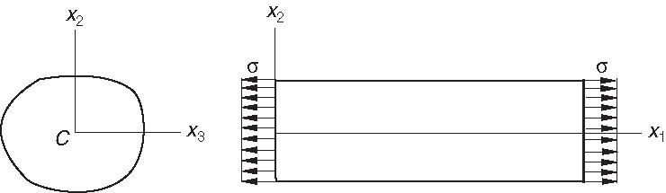
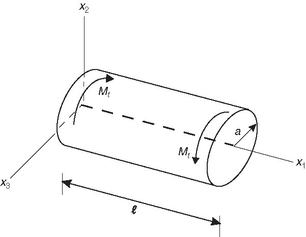

# AE831
## Continuum Mechanics
Lecture 9 - Linear Elasticity 
Dr. Nicholas Smith 
Wichita State University, Department of Aerospace Engineering

29 September, 2020

----
## schedule

- 29 Sep - Elastic Problems
- 1 Oct - Elastic Solid
- 6 Oct - Elastic Solid
- 8 Oct - Elastic Solid

---
## outline

<!-- vim-markdown-toc GFM -->

* linear elasticity
* equations of motion
* elastic problems

<!-- vim-markdown-toc -->

---
# linear elasticity

----
## mechanical properties

- Work-hardening
- Young's modulus
- Poisson's ratio
- Isotropic vs. anisotropic
- Homogeneous vs. inhomogeneous
- Bulk Modulus
- Shear Modulus

----
## linear elasticity

- In linear elasticity we make the following assumptions
    1.  Load deformation relationship is linear
    2.  Load rate/strain rate do not change results
    3.  Completely elastic
    4.  Small deformations
- In this case we can use Hooke's Law
`\[T_{ij} = C_{ijkl} E_{kl}\]`

- Although there are 81 terms in the stiffness tensor (`\(3^4\)`), only 21 of them are unique
- The symmetry of the stress and strain tensors, as well as the requirement that the strain energy function be positive definite reduces number of unique terms

----
## isotropic tensor

- Most engineering materials are isotropic, this means the stiffness is the same in any direction 
`\[C_{ijkl}^\prime = C_{ijkl}\]`

- A fourth-order isotropic tensor can be written as
`\[C_{ijkl} = \lambda \delta_{ij} \delta_{kl} + \alpha \delta_{ik} \delta_{jl} + \beta \delta_{il}\delta_{jk}\]`

- If we substitute this into Hooke's Law
`\[T_{ij} = \lambda E_{kk} \delta_{ij} + (\alpha + \beta) E_{ij}\]`

which is often written as 
`\[T_{ij} = \lambda E_{kk} \delta_{ij} + 2\mu E_{ij}\]`

----
## lamé constants

- `\(\lambda\)` and `\(\mu\)` are known as Lamé constants

- They are purely mathematical, but we can relate them to physical parameters
- We can solve Hooke's Law for `\(E_{ij}\)` to find
`\[E_{ij} = \frac{1}{2\mu} \left[T_{ij} - \frac{\lambda}{3\lambda + 2\mu}T_{kk}\delta_{ij}\right]\]`

- If we consider a state of uniaxial stress (as in a simple tension test) we find
`\[\begin{aligned}
	E_{11} &= \frac{\lambda + \mu}{\mu(3\lambda+2\mu)}T_{11}\\
	E_{22} &= E_{33} = - \frac{\lambda}{2\mu(3\lambda+2\mu)}T_{11}\\
	E_{12} &= E_{23} = E_{13} = 0
\end{aligned}\]`

----
## lamé constants

- We already know that the ratio of applied stress to strain in a uniaxial test is the Young's modulus 
`\[E_Y = \frac{T_{11}}{E_{11}} = \frac{\mu(3\lambda + 2\mu)}{\lambda + \mu}\]`

- The Poisson's ratio is defined as the ratio of transverse strain to axial strain
`\[\nu = -\frac{E_{22}}{E_{11}} = \frac{\lambda}{2(\lambda + \mu)}\]`

----
## lamé constants

- We can combine the previous equations to eliminate `\(\lambda\)` and find
`\[\mu = \frac{E_y}{2(1+\nu)}\]`

- We can use this to re-write Hooke's Law
`\[E_{ij} = \frac{1}{E_y} \left[(1+\nu)T_{ij} - \nu T_{kk} \delta_{ij}\right]\]`

----
## lamé constants

- If we consider a stress state of pure shear, we see that `\(E_{12} = \frac{1}{2\mu} T_{12}\)` is the only non-zero equation from Hooke' Law
- The shear modulus is defined as `\(G = \frac{\tau}{2E_{12}}\)`, so we see that `\(\mu = G\)`
- Finally consider a state of hydrostatic stress, where `\(T_{ij} = \sigma \delta_{ij}\)`
- Taking the contraction of Hooke's Law, we see that
`\[E_{ii} = e = \frac{3\sigma}{2\mu + 3\lambda}\]`

- And the bulk modulus is defined as the ratio of hydrostatic stress to change in volume, hence 
`\[k = \lambda + \frac{2}{3}\mu\]`

- Table 5.1 on p 212 gives a full conversion between physical and Lamé constants

---
# equations of motion

----
## infinitesimal deformation

- For infinitesimal deformations, `\(x_i \approx X_i\)`, so we find that
`\[a_i = \frac{\partial ^2 u_i}{\partial t^2}\]`

- Thus we find the equations of motion for small strains to be
`\[\rho_0 \frac{\partial ^2 u_i}{\partial t^2} = \rho_0 B_i T_{ij,j}\]`

----
## navier equations of motion

- Navier's equations use Hooke's Law and the strain displacement relations to re-write the equations of motion in terms of displacement only
- First we re-write Hooke's Law in terms of displacement
`\[T_{ij} = \lambda E_{kk} \delta_{ij} + 2\mu E_{ij} = \lambda e \delta_{ij} + \mu \left(\frac{\partial u_i}{\partial x_j} + \frac{\partial u_j}{\partial x_i}\right)\]`

- Where `\(e\)` is the dilatation, or change in volume

----
## navier equations of motion

- Now we note a couple of things when we take `\(T_{ij,j}\)`

`\[T_{ij,j} = \lambda \frac{\partial e}{\partial x_j} \delta_{ij} + \mu \left( \frac{\partial^2 u_i}{\partial x_j \partial x_j} + \frac{\partial u_j}{\partial x_j \partial x_i}\right)\]`

`\[\frac{\partial e}{\partial x_j} \delta_{ij} = \frac{\partial e}{\partial x_j}\]`

- Since order of differentiation does not matter, we can write
`\[\frac{\partial u_j}{\partial x_j \partial x_i} = \frac{\partial}{\partial x_i} \left( \frac{\partial u_j}{\partial x_j}\right) = \frac{\partial e}{\partial x_i}\]`

- Which gives the Navier equations as
`\[\rho_0 \frac{\partial^2 u_i}{\partial t^2} = \rho_0 B_i + (\lambda + \mu) \frac{\partial e}{\partial x_i} + \mu \frac{\partial^2 u_i}{\partial x_j \partial x_j}\]`

----
## principle of superposition

- Since Hooke's Law and the strain displacement relations are linear, we can add two separate solutions

- This is known as the principle of superposition
`\[\rho_0 \frac{\partial^2}{\partial t^2} \left(u_i^{(1)}+u_i^{(2)}\right) = \rho_0 \left(B_i^{(1)}+B_i^{(2)}\right) + \frac{\partial}{\partial x_j} \left(T_{ij}^{(1)}+T_{ij}^{(2)}\right)\]`

---
# elastic problems

----
## simple extension

----
## simple extension

- For a simple extension problem with any arbitrary cross-section, we would assume a stress state of 
`\[T_{ij} = \begin{bmatrix}
	\sigma & 0 & 0\\ 0 & 0 & 0\\ 0 & 0 & 0
\end{bmatrix}\]`

- To show that this assumption is correct, we need to satisfy the boundary conditions, equilibrium equations, and show that strains from this stress field are compatible

----
## Saint-Venant's principle

- In reality, it is difficult to apply a perfect distribution of stress on a face
- Saint-Venant's principle states that the effects of two statically equivalent stress distributions are essentially the same far away from the application of load

----
## torsion of a cylinder

----
## torsion of a cylinder

- For this problem we assume that the motion of each cross-sectional plane is the same as a rigid body rotation
- The angle of rotation, `\(\alpha\)` would be some function of position, `\(x_1\)`
- We can then find the displacements as
`\[u_i = \langle \alpha(x_1), 0, 0 \rangle \times \langle x_1, x_2, x_3 \rangle = \alpha(x_1) \langle 0, -x_3, x_2 \rangle\]`

- We can now find the non-zero strain components
`\[E_{12} = E_{21} = -\frac{1}{2} x_3 \frac{d\alpha}{dx_1}\]`
`\[E_{13} = E_{31} = \frac{1}{2} x_2 \frac{d\alpha}{dx_1}\]`

----
## torsion of a cylinder

- We can now determine the non-zero stresses
`\[T_{12} = T_{21} = -\mu x_3 \frac{d\alpha}{dx_1}\]`
`\[T_{13} = T_{31} = \mu x_2 \frac{d\alpha}{dx_1}\]`

- Compatibility is automatically satisfied, since we began with an assumption of displacement

----
## torsion of a cylinder

- Checking equilibrium gives 
`\[\begin{aligned}
	0 &= 0\\
	-\mu x_3 \frac{d^2\alpha}{dx_1^2} &= 0\\
	\mu x_2 \frac{d^2\alpha}{dx_1^2} &= 0
\end{aligned}\]`

- The only way for this to be satisfied for all `\(x_2\)` and `\(x_3\)` is if 
`\[\frac{d \alpha}{dx_1} = \alpha^\prime = \text{constant}\]`

----
## torsion of a cylinder

- Last, we check the boundary conditions
- On the lateral surface the normal is given by `\(n_i = 1/a\langle 0, x_2, x_3 \rangle\)` which gives a surface traction of
`\[\frac{1}{a} \langle x_2 T_{12} + x_3 T_{13}, 0, 0 \rangle\]`

- But substituting known values of `\(T\)` we find `\(x_2 T_{12} + x_3 T_{13} = \mu (-x_2x_3\alpha^\prime + x_2x_3\alpha^\prime) = 0\)`, so we have satisfied the traction free condition on the lateral surface

----
## torsion of a cylinder

- On the ends of the cylinder we find 
`\[\begin{aligned}
	t_i^{(l)} &= \mu \alpha^\prime \langle 0, -x_3, x_2 \rangle\\
	t_i^{(0)} &= -\mu \alpha^\prime \langle 0, -x_3, x_2 \rangle
\end{aligned}\]`

- This gives equal and opposite surface tractions corresponding to the moments. This may not correspond to the exact applied tractions, but we use Saint Venant' Principle again to assume this solution is valid away from the applied forces.

----
## torsion of a cylinder

- The above solution only satisfies the boundary conditions when the cross-section is circular
- For non-circular cross-sections, we assume that planar cross-sections will also undergo some warping
`\[u_i = \langle \phi(x_2,x_3), -\alpha(x_1)x_3, \alpha(x_1)x_2 \rangle\]`

- The second and third equilibrium equations remain the same, but the first equation becomes
`\[\nabla^2 \phi = \frac{\partial^2 \phi}{\partial x_2^2} + \frac{\partial ^2 \phi}{\partial x_3^2} = 0\]`

- To satisfy the boundary conditions, we also find that
`\[t_1 = 0 = \mu \left[\alpha^\prime (-n_2 x_3 + n_3 x_2) + \frac{d\phi}{dn}\right]\]`

----
## prandtl's torsion formulation

- Prandtl formulated the torsion problem with a stress function
- He assumed stress in the form 
`\[\begin{aligned}
	T_{12} &= T_{21} = \frac{\partial \psi}{\partial x_3}\\
	T_{13} &= T_{31} = -\frac{\partial \psi}{\partial x_2}
\end{aligned}\]`

- With all other `\(T_{ij} = 0\)`
- To satisfy equilibrium we have
`\[\frac{\partial}{\partial x_2} \frac{\partial \psi}{\partial x_3} - \frac{\partial}{\partial x_3} \frac{\partial \psi}{\partial x_2} = 0\]`

- Which is always satisfied so long as `\(\psi\)` is continuous to the second derivative
- For a particular problem, we would then choose a stress function capable of both satisfying boundary conditions and compatibility

----
## example

- Consider a rectangular bar with cross-sections defined by `\(-a \le x_2 \le a\)` and `\(-b \le x_3 \le b\)`
