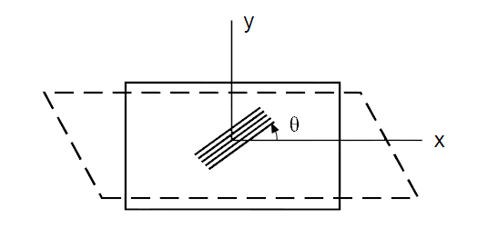
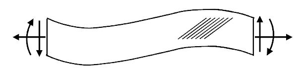
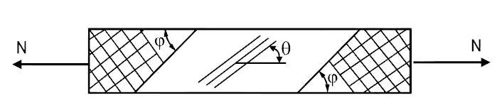
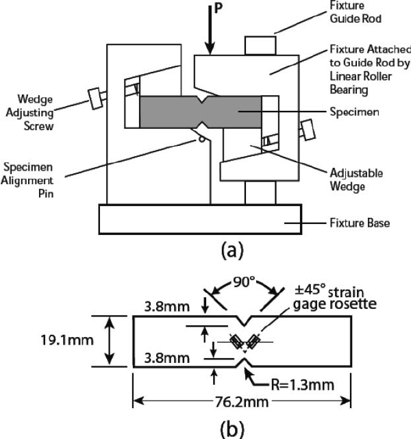
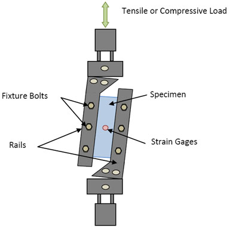

# AE831
## Continuum Mechanics
Lecture 11 - Anisotropy 
Dr. Nicholas Smith 
Wichita State University, Department of Aerospace Engineering

6 October, 2020

----
## schedule

- 6 Oct - Anisotropy
- 8 Oct - Large Deformation
- 13 Oct - Anisotropy and Large Deformation
- 15 Oct - Exam Review
- 20 Oct - Exam 2

----
## outline

<!-- vim-markdown-toc GFM -->

* anisotropic materials
* physical interpretation
* material symmetries
* experimental considerations

<!-- vim-markdown-toc -->

---
# anisotropic materials

----
## anisotropic materials

- Many materials exhibit different properties in different directions
- Composites are one example, but many polymers have anisotropy due to crystallinity
- Even some metals exhibit minor amounts of anisotropy due to grain boundaries and rolling
- Wood is a common anisotropic material

----
## anisotropic materials

----
## hooke's law

- Although it cannot be simplified as much as for isotropic materials, Hooke's Law still applies to linear anisotropic materials
`\[T_{ij} = C_{ijkl}E_{kl}\]`

----
## hooke's law

- Or, written in "engineering" form 
`\[\begin{bmatrix}
	T_{11}\\ T_{22} \\ T_{33} \\T_{23} \\ T_{13} \\ T_{12}
	\end{bmatrix}
	= \begin{bmatrix}
	C_{1111} & C_{1122} & C_{1133} & C_{1123} & C_{1113} & C_{1112} \\
	C_{1122} & C_{2222} & C_{2233} & C_{2223} & C_{1322} & C_{1222} \\
	C_{1133} & C_{2233} & C_{3333} & C_{2333} & C_{1333} & C_{1233} \\
	C_{1123} & C_{2223} & C_{2333} & C_{2323} & C_{1323} & C_{1223} \\
	C_{1113} & C_{1322} & C_{1333} & C_{1323} & C_{1313} & C_{1213} \\
	C_{1112} & C_{1222} & C_{1233} & C_{1223} & C_{1213} & C_{1212}
	\end{bmatrix}\begin{bmatrix}
	E_{11}\\ E_{22} \\ E_{33} \\2E_{23} \\ 2E_{13} \\ 2E_{12}
\end{bmatrix}\]`

----
## hooke's law

- Note: while the most common order of terms is the one I have written, the shear terms can be written in a different order
- This will also change the order of the corresponding stiffness terms
- Also, the indexes are often written in contracted form (`\(11 = 1\)`, `\(22 = 2\)`, `\(33 = 3\)`, `\(23 = 4\)`, `\(13 = 5\)`, `\(12 = 6\)`) this makes it not immediately apparent which convention somebody is using
- Finally, the shear tensorial strains (which must be multiplied by 2) can often be expressed as engineering shear strains (`\(\gamma_{12} = 2 E_{12}\)`)

----
## transformation

- We know that 
`\[\sigma_{mn}^\prime = Q_{mi}Q_{nj}\sigma_{ij}\]`
- We can expand this to write in terms of engineering stress
- We will expand only two terms, as they show the general pattern for all 6

----
## stress transformation 

`\[\begin{gathered}
	\sigma_{1}^\prime = \sigma_{11}^\prime =  Q_{11}Q_{11} \sigma_{11} + Q_{11}Q_{12} \sigma_{12} + Q_{11}Q_{13}\sigma_{13}\\
	+ Q_{12}Q_{11} \sigma_{21} + Q_{12}Q_{12} \sigma_{22} + Q_{12}Q_{13}\sigma_{23}\\
	+ Q_{13}Q_{11} \sigma_{31} + Q_{13}Q_{12} \sigma_{32} + Q_{13}Q_{13}\sigma_{33}
\end{gathered}\]` 

`\[\begin{gathered}
	\sigma_{1}^\prime = Q_{11}^2 \sigma_{1} + Q_{12}^2 \sigma_{2} + Q_{13}^2\sigma_{3}\\
	+ 2 Q_{11}Q_{12} \sigma_{6} + 2Q_{11}Q_{13}\sigma_{5} + 2Q_{12}Q_{13}\sigma_{4}
\end{gathered}\]`

----
## stress transformation 

`\[\begin{gathered}
	\sigma_{4}^\prime = \sigma_{23}^\prime =  Q_{21}Q_{31} \sigma_{11} + Q_{21}Q_{32} \sigma_{12} + Q_{21}Q_{33}\sigma_{13}\\
	+ Q_{22}Q_{31} \sigma_{21} + Q_{22}Q_{32} \sigma_{22} + Q_{22}Q_{33}\sigma_{23}\\
	+ Q_{23}Q_{31} \sigma_{31} + Q_{23}Q_{32} \sigma_{32} + Q_{23}Q_{33}\sigma_{33}
\end{gathered}\]` 

`\[\begin{gathered}
	\sigma_{4}^\prime = Q_{21}Q_{31} \sigma_{1} + Q_{22}Q_{32} \sigma_{22} + Q_{23}Q_{33}\sigma_{3}\\
	+ (Q_{21}Q_{32}+Q_{22}Q_{31}) \sigma_{6} + (Q_{21}Q_{33}+Q_{23}Q_{31})\sigma_{5}\\
	+ (Q_{22}Q_{33}+Q_{23}Q_{32})\sigma_{4}
\end{gathered}\]`

----
## stress transformation

- We often write `\(\sigma^\prime = R_\sigma \sigma\)` for engineering notation 
`\[R_\sigma = \begin{bmatrix}
	Q_{11}^2 & Q_{12}^2 & Q_{13}^2 & 2Q_{12}Q_{13} & 2 Q_{11} Q_{13} & 2Q_{11}Q_{12}\\
	Q_{21}^2 & Q_{22}^2 & Q_{23}^2 & 2Q_{22}Q_{23} & 2 Q_{21} Q_{23} & 2Q_{21}Q_{22}\\
	Q_{31}^2 & Q_{32}^2 & Q_{33}^2 & 2Q_{32}Q_{33} & 2 Q_{31} Q_{33} & 2Q_{31}Q_{32}\\
	Q_{21}Q_{31} & Q_{22}Q_{32} & Q_{23}Q_{33} & Q_{23}Q_{32} + Q_{22}Q_{33} & Q_{23}Q_{31} + Q_{21}Q_{33} & Q_{22}Q_{31} + Q_{21}Q_{32}\\
	Q_{11}Q_{31} & Q_{12}Q_{32} & Q_{13}Q_{33} & Q_{13}Q_{32} + Q_{12}Q_{33} & Q_{13}Q_{31} + Q_{11}Q_{33} & Q_{12}Q_{31} + Q_{11}Q_{32}\\
	Q_{11}Q_{21} & Q_{12}Q_{22} & Q_{13}Q_{23} & Q_{13}Q_{22} + Q_{12}Q_{23} & Q_{13}Q_{21} + Q_{11}Q_{23} & Q_{12}Q_{21} + Q_{11}Q_{22}
\end{bmatrix}\]`

----
## strain transformation

- We can follow the exact same procedure to transform strain
- The values are almost the same, notice the highlighted terms
`\[ R_\epsilon = \begin{bmatrix}
	Q_{11}^2 & Q_{12}^2 & Q_{13}^2 & \colorbox[yellow]{Q_{12}Q_{13}} &  \colorbox[yellow]{Q_{11} Q_{13}} & \colorbox[yellow]{Q_{11}Q_{12}}\\
	Q_{21}^2 & Q_{22}^2 & Q_{23}^2 & \colorbox[yellow]{Q_{22}Q_{23}} &  \colorbox[yellow]{Q_{21} Q_{23}} & \colorbox[yellow]{Q_{21}Q_{22}}\\
	Q_{31}^2 & Q_{32}^2 & Q_{33}^2 & \colorbox[yellow]{Q_{32}Q_{33}} &  \colorbox[yellow]{Q_{31} Q_{33}} & \colorbox[yellow]{Q_{31}Q_{32}}\\
	\colorbox[yellow]{2Q_{21}Q_{31}} & \colorbox[yellow]{2Q_{22}Q_{32}} & \colorbox[yellow]{2Q_{23}Q_{33}} & Q_{23}Q_{32} + Q_{22}Q_{33} & Q_{23}Q_{31} + Q_{21}Q_{33} & Q_{22}Q_{31} + Q_{21}Q_{32}\\
	\colorbox[yellow]{2Q_{11}Q_{31}} & \colorbox[yellow]{2Q_{12}Q_{32}} & \colorbox[yellow]{2Q_{13}Q_{33}} & Q_{13}Q_{32} + Q_{12}Q_{33} & Q_{13}Q_{31} + Q_{11}Q_{33} & Q_{12}Q_{31} + Q_{11}Q_{32}\\
	\colorbox[yellow]{2Q_{11}Q_{21}} & \colorbox[yellow]{2Q_{12}Q_{22}} & \colorbox[yellow]{2Q_{13}Q_{23}} & Q_{13}Q_{22} + Q_{12}Q_{23} & Q_{13}Q_{21} + Q_{11}Q_{23} & Q_{12}Q_{21} + Q_{11}Q_{22}
\end{bmatrix}
\]`

----
## stiffness transformation

- We can now formulate the transformation of the stiffness matrix. We know that
`\[\sigma^\prime = R_\sigma \sigma = C^\prime E^\prime\]`

- And since `\(\sigma = C E\)`, we can say
`\[R_\sigma C E = C^\prime E^\prime\]`

- Now we know that `\(E^\prime = R_E E\)`, so we substitute that to find
`\[R_\sigma C E = C^\prime R_E E\]`

----
## stiffness transformation

- We can right multiply both sides by `\(E^{-1}\)` to cancel `\(E\)`
- Then we can right multiply both sides by `\(R_E^{-1}\)` to get `\(C^\prime\)` by itself 
`\[C^\prime = R_\sigma C (R_E)^{-1}\]`

- Note that `\(R_E^{-1} = R_\sigma^T\)`

----
## conventions

- There are two things that can be very confusing when transforming engineering stiffness
- First, while I have used the most standard ordering of stress/strain terms, not everyone uses the same order
- Second, the equations used here are for engineering strain (which is the most common)
- However, tensorial strain may also be used, in which case `\(R_\sigma = R_E\)`, but that adds other complications

---
# physical interpretation

----
## physical interpretation

- To find the physical interpretation of elastic constants in Hooke's Law, it is easiest to use the inverse form
- If we include the thermal effects, we have
`\[T_{ij} = C_{ijkl}(E_{kl}-\alpha_{kl}\Delta T)\]`

- And the inverse form, where the compliance tensor, `\(S_{ijkl} = C_{ijkl}^{-1}\)` is
`\[E_{ij} = S_{ijkl} T_{kl} + \alpha_{ij}\Delta T\]`

----
## compliance 

`\[\begin{bmatrix}
	E_{11}\\ E_{22} \\ E_{33} \\2E_{23} \\ 2E_{13} \\ 2E_{12}
\end{bmatrix}
= \begin{bmatrix}
	S_{1111} & S_{1122} & S_{1133} & S_{1123} & S_{1113} & S_{1112} \\
	S_{1122} & S_{2222} & S_{2233} & S_{2223} & S_{1322} & S_{1222} \\
	S_{1133} & S_{2233} & S_{3333} & S_{2333} & S_{1333} & S_{1233} \\
	S_{1123} & S_{2223} & S_{2333} & S_{2323} & S_{1323} & S_{1223} \\
	S_{1113} & S_{1322} & S_{1333} & S_{1323} & S_{1313} & S_{1213} \\
	S_{1112} & S_{1222} & S_{1233} & S_{1223} & S_{1213} & S_{1212}
\end{bmatrix}\begin{bmatrix}
	T_{11}\\ T_{22} \\ T_{33} \\T_{23} \\ T_{13} \\ T_{12}
\end{bmatrix} + \begin{bmatrix}
	\alpha_{11} \\ \alpha_{22} \\ \alpha_{33} \\ 2\alpha_{23} \\ 2\alpha_{13} \\ 2\alpha_{12}
\end{bmatrix}\Delta T\]`

----
## physical interpretation

- If we now consider the case of uniaxial tension, we see that
`\[\begin{aligned}
	E_{11} &= S_{1111} T_{11}\\
	E_{22} &= S_{1122} T_{11}\\
	E_{33} &= S_{1133} T_{11}\\
	2E_{23} &= S_{1123} T_{11}\\
	2E_{13} &= S_{1113} T_{11}\\
	2E_{12} &= S_{1112} T_{11}
\end{aligned}\]`

- `\(S_{1111}\)` is familiar, acting like `\(1/E_Y\)`

----
## poisson's ratio

- For isotropic materials we defined Poisson's ratio as `\(\nu = -E_{22}/E_{11}\)`
- For anisotropic materials, we can have a different Poisson's ratio acting in different directions
- We define `\(\nu_{ij} = -E_{jj}/E_{ii}\)` (with no summation), the ratio of the transverse strain in the `\(j\)` direction when stress is applied in the `\(i\)` direction

----
## poisson's ratio

- For this example we can find `\(\nu_{12}\)` and `\(\nu_{13}\)` as
`\[\begin{aligned}
	\nu_{12} &= -E_{22}/E_{11} = -S_{1122}/S_{1111}\\
	\nu_{13} &= -E_{33}/E_{11} = -S_{1133}/S_{1111}
\end{aligned}\]`

----
## poisson's ratio

- Note that we cannot, in general, say that `\(\nu_{12} = \nu_{21}\)`
- However, due to the symmetry of the stiffness/compliance tensors, we know that 
`\[\begin{aligned}
	\nu_{21} E_{x} &= \nu_{12} E_{y}\\
	\nu_{31} E_{x} &= \nu_{13} E_{z}\\
	\nu_{32} E_{y} &= \nu_{23} E_{z}
\end{aligned}\]`

- Where `\(E_{x}\)` refer's to the Young's Modulus in the `\(x\)`-direction, etc.

----
## shear coupling coefficients

- An unfamiliar effect is that shear strains are introduced from a normal stress
- We define shear coupling coefficients as `\(\eta_{1112} = \eta_{16} = -2E_{12}/E_{11}\)` due to `\(T_{11}\)`
- These coupling terms can also effect shear strain in a different plane from the applied shear stress

----
## shear coupling

- Like the Poisson's ratio, these are not entirely independent
`\[\eta_{61} E_{x} = \eta_{16} G_{6}\]`

- Where `\(G_6\)` is the shear modulus in the `\(12\)` plane

----
## shear coupling 

- Shear coupling coefficients are sometimes placed in two groups
- Coefficients of mutual influence relate shear stress to normal strain and normal stress to shear strain
- Chentsov coefficients relate shear stress in one plane to shear strain in another plane
- In general we can say
`\[\eta_{nm} E_m = \eta_{mn} G_{n} \qquad (m=1,2,3) \qquad (n=4,5,6)\]`

and

`\[\eta_{nm} G_m = \eta_{mn} G_n \qquad (m,n = 4,5,6) \qquad m \ne n\]`

---
# material symmetries

----
## material symmetries

- Very few anisotropic materials are fully anisotropic
- Most have some degree of symmetry
- We will consider monoclinic, transversely isotropic, and orthotropic symmetries

----
## symmetry

- Let `\(S_1\)` be the plane with a normal in the 1-direction

- The transformation describing a reflection with respect to the plane `\(S_1\)` is 
`\[Q = \begin{bmatrix}
	-1 & 0 & 0\\
	0 & 1 & 0\\
	0 & 0 & 1
\end{bmatrix}\]`

- If a material is symmetric about `\(S_1\)`, we know that
`\[C_{ijkl} = C_{ijkl}^\prime = Q_{mi}Q_{nj}Q_{ok}Q_{pl} C_{mnop}\]`

----
## monoclinic symmetry

- A monoclinic material is symmetric about one plane
- If we consider the 1-direction to be the plane of material symmetry, we can use the previous equation with the `\(Q\)` found earlier

----
## monoclinic symmetry

- As an example, we find the `\(C_{1112} = Q_{m1}Q_{n1}Q_{o1}Q_{p2}C_{mnop}\)`, however when `\(i\ne j\)`, `\(Q_{ij}=0\)`
- This means we have `\(C_{1112} = (-1)^3(1) C_{1112}\)`, which can only be satisfied when `\(C_{1112} = 0\)`
- We similarly can show that `\(C_{1113} = C_{1222} = C_{1223} C_{1233} = C_{1322} = C_{1323} = C_{1333} =0\)`

----
## monoclinic symmetry 

`\[\begin{bmatrix}
	T_{11}\\ T_{22} \\ T_{33} \\T_{23} \\ T_{13} \\ T_{12}
\end{bmatrix}
= \begin{bmatrix}
	C_{1111} & C_{1122} & C_{1133} & C_{1123} & 0 & 0 \\
	C_{1122} & C_{2222} & C_{2233} & C_{2223} & 0 & 0 \\
	C_{1133} & C_{2233} & C_{3333} & C_{2333} & 0 & 0 \\
	C_{1123} & C_{2223} & C_{2333} & C_{2323} & 0 & 0 \\
	0 & 0 & 0 & 0 & C_{1313} & C_{1213} \\
	0 & 0 & 0 & 0 & C_{1213} & C_{1212}
\end{bmatrix}\begin{bmatrix}
	E_{11}\\ E_{22} \\ E_{33} \\2E_{23} \\ 2E_{13} \\ 2E_{12}
\end{bmatrix}\]`

----
## orthotropic symmetry

- If a material has two mutually perpendicular planes of symmetry (for example, `\(S_1\)` and `\(S_2\)` with normals in the 1 and 2 directions), then `\(S_3\)` plane will also automatically be plane of symmetry
- This state of symmetry is known orthotropy
- Orthotropic materials are more common in engineering use than monoclinic
- All shear coupling terms are zero for orthotropic materials

----
## orthotropic symmetry 

`\[\begin{bmatrix}
	T_{11}\\ T_{22} \\ T_{33} \\T_{23} \\ T_{13} \\ T_{12}
\end{bmatrix}
= \begin{bmatrix}
	C_{1111} & C_{1122} & C_{1133} & 0 & 0 & 0 \\
	C_{1122} & C_{2222} & C_{2233} & 0 & 0 & 0 \\
	C_{1133} & C_{2233} & C_{3333} & 0 & 0 & 0 \\
	0 & 0 & 0 & C_{2323} & 0 & 0 \\
	0 & 0 & 0 & 0 & C_{1313} & 0 \\
	0 & 0 & 0 & 0 & 0 & C_{1212}
\end{bmatrix}\begin{bmatrix}
	E_{11}\\ E_{22} \\ E_{33} \\2E_{23} \\ 2E_{13} \\ 2E_{12}
\end{bmatrix}\]`

----
## transversely isotropic symmetry

- If there exists a plane, such as the `\(S_3\)` plane, where any plane perpendicular to that plane is a plane of symmetry, we call this transverse isotropy
- The direction normal to that plane is the axis of transverse isotropy

----
## transversely isotropic symmetry 

`\[\begin{bmatrix}
	T_{11}\\ T_{22} \\ T_{33} \\T_{23} \\ T_{13} \\ T_{12}
\end{bmatrix}
= \begin{bmatrix}
	C_{1111} & C_{1122} & C_{1133} & 0 & 0 & 0 \\
	C_{1122} & C_{1111} & C_{1133} & 0 & 0 & 0 \\
	C_{1133} & C_{1133} & C_{3333} & 0 & 0 & 0 \\
	0 & 0 & 0 & C_{1313} & 0 & 0 \\
	0 & 0 & 0 & 0 & C_{1313} & 0 \\
	0 & 0 & 0 & 0 & 0 & 1/2(C_{1111}-C_{2222})
\end{bmatrix}\begin{bmatrix}
	E_{11}\\ E_{22} \\ E_{33} \\2E_{23} \\ 2E_{13} \\ 2E_{12}
\end{bmatrix}\]`

---
# experimental considerations

----
## characterizing anisotropic materials

- Characterizing anisotropic materials is not as simple as isotropic materials
- Requires additional testing
- 2 unique properties for isotropic (can be found with one test)
- 5 unique properties for transversely isotropic
- 9 unique properties for orthotropic

----
## characterizing anisotropic materials

- Also can be difficult to obtain state of pure shear/tension with traditional gripping
- If material is heterogeneous that can introduce other challenges
- Specimen alignment is much more important than for isotropic materials

----
## tensile testing

- If we consider an orthotropic material (such as a composite lamina), no shear is introduced when the fibers are perfectly aligned in the load direction
- When orthotropic (or transversely isotropic) material is rotated, shear-coupling terms can be introduced
- This shear deformation can cause failure at the grips

----
## tensile testing

----
## tensile testing

----
## shear testing

- Just as grip constraints can make a state of pure tension difficult to obtain, it can be difficult to obtain a pure state of shear
- There are many different shear test methods for anisotropic materials, most involve specialized grips and specialized specimen geometry

----
## iosipescu shear

 <!-- .element width="40%" -->

----
## two-rail shear

----
## review

- Group 1: How many (theoretically) tests required to characterize a monoclinic material
- Group 2: How many (theoretically) tests to characterize an orthotropic material

----
## reading for next class

- Analytic techniques for anisotropic elasticity: [link](http://solidmechanics.org/text/Chapter5_5/Chapter5_5.htm)
- Large Deformation - pp. 334 - 349
