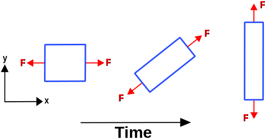

# AE831
## Continuum Mechanics
Lecture 8 - Linear Elasticity 
Dr. Nicholas Smith 
Wichita State University, Department of Aerospace Engineering

17 September, 2020

----
## schedule

- 17 Sep - Linear Elasticity
- 22 Sep - Equations of Motion, HW 4 Due
- 24 Sep - Elastic Problems
- 29 Sep - Elastic Problems, HW 5 Due

---
## outline

<!-- vim-markdown-toc GFM -->

* equations of motion
* energetic conjugates
* corotational derivative
* heat, energy, and entropy
* integral formulation

<!-- vim-markdown-toc -->

---
# equations of motion

----
## reference configuration

- At this point it is desirable to formulate equations of motion in terms of the first and second Piola-Kirchhoff stress tensors
- Recall for Cauchy stress 
`\[T_{ij,j} + \rho B_i = \rho a_i\]`

- Now we substitute `\(T_{ij} = \frac{1}{J} T_{im}^0F_{jm}\)` to get
`\[T_{ij,j} = \frac{\partial}{\partial x_j} \left(\frac{1}{J} T_{im}^0F_{jm}\right) = \frac{F_{jm}}{J} \frac{\partial T^0_{im}}{\partial x_j} + T^0_{im} \frac{\partial}{\partial x_j} \frac{F_{im}}{J}= \frac{F_{jm}}{J} \frac{\partial T^0_{im}}{\partial x_j}\]`

----
## reference configuration

- Since `\(T_{ij}^0\)` is expressed in terms of the reference configuration, we desire to change the partial derivative from `\(x_j\)` to `\(X_j\)` which we can do as follows
`\[\frac{\partial T_{ij}}{\partial x_j}\frac{F_{jm}}{J} \frac{\partial T^0_{im}}{\partial x_j} = \frac{1}{J} \frac{\partial x_j}{\partial X_m} \frac{\partial T^0_{im}}{\partial X_n}\frac{\partial X_n}{\partial x_j} = \frac{1}{J} \delta_{mn} \frac{\partial T^0_{im}}{\partial X_n}\]`

- Substituting this into the equation of motion, and multiplying both sides by `\(J\)` gives
`\[\frac{\partial T^0_{ij}}{\partial X_j} + J \rho B_i = J \rho a_i\]`

- The quantity `\(J \rho\)` is sometimes written as `\(\rho^0\)`

---
# energetic conjugates

----
## work and power

- Stress and strains are considered *energetically conjugate* if their double-dot product reflects the strain energy
- Work is defined as force times distance, and power is force time velocity 
`\[P = \int F_i dv_i\]`

- If we multiply and divide by the differential volume, we find
`\[P = \int \frac{F_i}{A_j} \frac{dv_i}{dx_j} dV\]`

----
## power

- Since `\(F_i\)` is the force in the deformed configuration and `\(A_j\)` is the area in the deformed configuration, `\(\frac{F_i}{A_j}\)` is the true stress (Cauchy stress)
- We also see that `\(\frac{dv_i}{dx_j}\)` is the velocity gradient, so we can re-write as
`\[P = \int \sigma_{ij} v_{i,j} dV\]`

- We also recall that `\(v_{i,j} = D_{ij} + W_{ij}\)`
`\[P = \int \sigma_{ij} (D_{ij} + W_{ij}) dV\]`

- But since `\(W_{ij}\)` is anti-symmetric and `\(D_{ij}\)` is symmetric, we have 
`\[P = \int \sigma_{ij} D_{ij} dV\]`

- This means that `\(D_{ij}\)` is the energetic conjugate for `\(\sigma_{ij}\)` (text calls this stress power)

----
## deformation gradient

- The velocity gradient is an Eulerian property, but we can convert it to Lagrangian using the deformation gradient
- If we take the time derivative of the deformation gradient we find
`\[\dot{F_{ij}} = \frac{d}{dt} \left(\frac{\partial x_i}{\partial X_j}\right) = \frac{\partial}{\partial X_j} \left(\frac{dx}{dt}\right) = \frac{\partial v_i}{\partial X_j}\]`

- We can now apply the chain rule to find
`\[\dot{F_{ij}} = \frac{\partial v_i}{\partial X_j} = \left(\frac{\partial v_i}{\partial x_k}\right) \left(\frac{\partial x_k}{\partial X_j}\right)\]`

- We can re-arrange to write the velocity gradient in terms of the
deformation gradient 
`\[v_{i,j} = \dot{F_{ik}} F^{-1}_{kj}\]`

----
## first piola-kirchhoff

- If we return to power in terms of stress and the velocity gradient, we can now re-write in terms of the deformation gradient
`\[P = \int \sigma_{ij} v_{i,j} dV = \int \sigma_{ij} \dot{F_{ik}} F^{-1}_{kj} dV\]`

- We can also integrate over the reference volume by using `\(dV = J dV_0\)`
`\[P = \int \sigma_{ij} \dot{F_{ik}} F^{-1}_{kj} J dV_0\]`

----
## first piola-kirchhoff

- Recall that the first Piola-Kirchhoff stress tensor is given as
`\[\sigma^0_{ij} = J \sigma_{im}F_{jm}^{-1}\]`

- Changing indexes, `\(m\)` to `\(j\)` and `\(j\)` to `\(k\)`, we can substitute 
`\[P = \int \sigma^0_{ik} \dot{F_{ik}} dV_0\]`

- Thus the material derivative of the deformation gradient is the energetic conjugate for the first piola-kirchhoff stress tensor

----
## second piola-kirchhoff

- To find the energetic conjugate for the second Piola-Kirchhoff stress tensor, we return to power in terms of Cauchy stress and the deformation rate tensor 
`\[P = \int \sigma_{ij} D_{ij} dV\]`

- This time we will replace `\(D_{ij}\)` with `\(E_{ij}^*\)`, Consider
`\[ds^2 = dS^2 + 2dX_i E^*_{ij} dX_j\]`

- Taking the material derivative of both sides we find
`\[\frac{D}{Dt} ds^2 = 2dX_i \frac{D E^*_{ij}}{Dt} dX_j\]`

----
## second piola-kirchhoff

- But we also know that
`\[\frac{D}{Dt} ds^2 = 2 dx_i D_{ij} dx_j = 2 F_{im}dX_m D_{ij} F_{jn} dX_n\]`

- Re-arranging terms, we can see that
`\[\frac{D E^*_{ij}}{Dt} = F_{mi} D_{mn} F_{nj}\]`

- Solving for `\(D_{mn}\)` gives
`\[D_{ij} = F^{-1}_{mi} \dot{E}^*_{mn} F^{-1}_{nj}\]`

----
## second piola-kirchhoff

- Substituting gives
`\[P = \int \sigma_{ij} F^{-1}_{mi} \dot{E}^*_{mn} F^{-1}_{nj} J dV_0\]`

- And the second Piola-Kirchhoff tensor in terms of Cauchy stress is
`\[\tilde{\sigma}_{ij} = J F_{im}^{-1}\sigma_{mn}F_{jn}^{-1}\]`

- But since the Cauchy stress tensor is symmetric, we can re-write it as 
`\[\tilde{\sigma}_{ij} = J F_{im}^{-1}\sigma_{nm}F_{jn}^{-1}\]`

- Which we can now substitute to find
`\[P = \int \tilde{\sigma}_{ij} \dot{E}^*_{ij} dV_0\]`

----
## examples

- First let us consider an incompressible rubber specimen in tension
- Since it is incompressible, the volume must remain constant
`\[L_0 A_0 = L_f A_f\]`

----
## examples

---
# corotational derivative

----
## corotational derivative

- Note: textbook addresses co-rotational derivative on pp. 483-486
- Rigid body rotations can cause problems when taking derivatives
- In our last example, the stress rotated from the `\(1\)` direction to the `\(2\)` direction, thus we can see that `\(\dot{\sigma_{ij}} \ne 0\)`
- However, the rate of deformation tensor, `\(D_{ij}\)` is zero because there is no deformation

----
## material indifference

- We have many different stress (Cauchy, Piola-Kirchhoff) and strain (right and left Cauchy, Lagrangian, Eulierian) tensors
- A proper constitutive equation should be invariant under transformation 
`\[T_{ij}^* = Q_{im}(t) T_{mn} Q_{jn}(t)\]`

- This dictates which stress and strain tensors can be related in a constitutive equation
- We can show that the Right Cauchy-Green strain tensor should not be used with the Cauchy Stress tensor

----
## corotational derivative

- In general, the material derivative of a tensor which is material indifferent (also called an objective tensor) is not objective
- This motivates a new derivative to find the objective rate tensor for an objective tensor
- We can derive a corotational derivative for stress and strain by considering the most general form of linear materials
`\[\sigma^0_{ij} = C_{ijkl} E^*_{kl}\]`

- Now we substitute the Cauchy stress and solve to find
`\[\sigma_{ij} = \frac{1}{J} F_{im} C_{mnop} E_{op} F_{jn}\]`

----
## corotational derivative

- If we now take the material derivative we find
`\[\dot{\sigma}_{ij} = -\frac{\dot{J}}{J^2} F_{im} C_{mnop} E_{op} F_{jn} + \frac{1}{J} \dot{F}_{im} C_{mnop} E_{op} F_{jn} + \frac{1}{J} F_{im} C_{mnop} \dot{E}_{op} F_{jn} + \frac{1}{J} F_{im} C_{mnop} E_{op} \dot{F}_{jn}\]`

- We can now substitute several identities, `\(\frac{\dot{J}}{J} = D_{ii}\)`, `\(\dot{F}_{ij} = v_{i,m} F_{mj}\)`,  and `\(\dot{E}^*_{ij} = F_{mi} D_{mn} F_{nj}\)` to find
`\[\begin{gathered}
	\dot{\sigma}_{ij} = \frac{1}{J} \left[-D_{kk} F_{im} C_{mnop} E_{op} F_{jn} + v_{i,k}F_{km} C_{mnop} E_{op} F_{jn} + \right.\\
	\left. F_{im} C_{mnop} F_{ko}D_{kl}F_{lp} F_{jn} + F_{im} C_{mnop} E_{op} F_{kj} v_{n,k}\right]
\end{gathered}\]`

----
## corotational derivative

 - Now we recall to simplify things somewhat
`\[\dot{\sigma}_{ij} = -D_{kk} \sigma_{ij} + v_{i,k}\sigma_{kj} + \sigma_{ik} v_{j,k} + \frac{1}{J}F_{im} C_{mnop} F_{ko}D_{kl}F_{lp} F_{jn}\]`

- This is often written as
`\[\dot{\sigma}_{ij} -  v_{i,k}\sigma_{kj} - \sigma_{ik} v_{j,k} = -D_{kk} \sigma_{ij} + \frac{1}{J}F_{im} C_{mnop} F_{ko}D_{kl}F_{lp} F_{jn}\]`

- The left hand side is called the Lie Derivative, and is usually written as `\(\accentset{\nabla}{\sigma}_{ij}\)`
- `\(D_{kk} \approx 0\)` in almost all cases, and is usually neglected
- We also define `\(C^\prime_{ijkl} \equiv  \frac{1}{J}F_{im} F_{jn} C_{mnop} F_{ko} F_{lp}\)` to find
`\[\accentset{\nabla}{\sigma}_{ij} = C^\prime _{ijkl} D_{kl}\]`

----
## jaumann derivative

- For the special case when an object is rotating, but not deforming, we have `\(D_{ij} = 0\)` which gives
`\[\accentset{\nabla}{\sigma}_{ij} = \dot{\sigma}_{ij} -  v_{i,k}\sigma_{kj} - \sigma_{ik} v_{j,k} = 0\]`

- And we can more clearly see the terms which account for `\(\dot{\sigma}_{ij} \ne 0\)`
- Since `\(D_{ij} = 0\)`, we can also re-write `\(v_{i,j} = D_{ij} + W_{ij} = W_{ij}\)`
- We also know that `\(W_{ij} = -W_{ji}\)` which leads to the Jaumann derivative
`\[\mathring{\sigma}_{ij} = \dot{\sigma}_{ij} - W_{ik} \sigma_{kj} + \sigma_{ik} W_{kj}\]`

----
## example

- Calculate `\(\dot{\sigma}_{ij}\)` and `\(\mathring{\sigma}_{ij}\)` for an object under constant stress 
`\[\sigma = \begin{bmatrix}
	20 & 0 \\ 0 & 0
\end{bmatrix}\]`

- With 2D rotation of 
`\[R = \begin{bmatrix}
	\cos \theta &-\sin \theta\\ \sin \theta & \cos \theta
\end{bmatrix}\]` 
and 
`\[\dot{R} = \omega\begin{bmatrix}
	-\sin \theta & -\cos \theta\\ \cos \theta & -\sin \theta
\end{bmatrix}\]`

---
# heat, energy, and entropy

----
## heat

- Let `\(q_i\)` be the vector whose magnitude gives the rate of heat flow across a unit area and whose direction indicates the direction of heat flow
- The net flow of heat into a differential element is
`\[Q = -q_{i,i} dV\]`

- Using the Fourier heat conduction law in steady state conditions we find 
`\[q_i = -\kappa \nabla \Theta\]`

- In steady state conditions, no should be no net rate of heat flow, which produces the governing Laplace equation
`\[\nabla^2 \Theta = 0\]`

----
## energy

- If we consider only the energy contributions from strain energy, kinetic energy, and heat
- by the conservation of energy, the rate of increase in energy for a particle equals the rate of work done plus the heat added
`\[\frac{D}{Dt}(U + KE) = P + Q_c + Q_s\]`

- Where `\(P = \frac{D}{Dt}(KE) + T_{ij} v_{i,j}dV\)` and `\(Q_c = -q_{i,j}dV\)`
`\[\frac{D U}{Dt} = T_{ij} v_{i,j}dV -q_{i,j}dV + Q_s\]`

- This is also sometimes written as energy per unit mass as
`\[\rho \frac{D u }{Dt} = T_{ij} v_{i,j} - q_{i,j} + \rho q_s\]`

----
## entropy inequality

- Let `\(\eta(x_i,t)\)` denote the entropy per unit mass
- The rate of entropy following a particle is
`\[\frac{D}{Dt}(\rho \eta dV) = \rho dV \frac{D \eta}{Dt} + \eta \frac{D}{Dt} (\rho dV) = \rho dV \frac{D \eta}{Dt}\]`

- The entropy inequality states that the rate of increase of entropy is always greater than or equal to the entropy inflow plus the entropy supply
`\[\rho \frac{D \eta}{Dt} \ge -\text{div} \left(\frac{q}{\Theta}\right) + \frac{\rho q_s}{\Theta}\]`

----
## helmholtz energy function

- The Helmholtz energy function is defined as 
`\[A = u - \Theta \eta\]`

- We can use this relationship to re-write the entropy inequality as
`\[-\left(\rho \frac{D A}{Dt} + \rho\eta \frac{D \Theta}{Dt}\right) + T_{ij}D_{ij}-\frac{q_i}{\Theta}\frac{\partial \Theta}{\partial x_i} \ge 0\]`

---
# integral formulation

----
## integral formulation

- To this point, we have derived field equations using the differential element approach (this is sometimes referred to as local principles)
- When can also formulate these principles globally by integrating over the volume. If the functions are smooth, these two methods will be equivalent
- In certain problems the integral formulation may be more convenient, or more numerically accurate when solving problems numerically

----
## conservation of mass

- The conservation of mass states that the rate of increase of mass in a fixed part of a material is zero 
`\[\begin{aligned}
	\frac{D}{Dt} \int_{V_m} \rho dV &= 0\\
	\int_{V_m} \frac{D}{Dt} (\rho dV) &= 0\\
	\int_{V_m} dV \frac{D}{Dt}\rho + \rho \frac{D}{Dt} dV &= 0
\end{aligned}\]`

----
## conservation of mass

- We previously found that `\(D_{ii}\)` is related to the rate of change of the volume, which we can write in terms of the velocity gradient as `\[\frac{D dV}{Dt} = v_{i,i} dV\]`
- We can substitute this to find
`\[\int_{V_m} dV \frac{D}{Dt}\rho + \rho v_{i,i} dV = 0\]`

- Since this must be true for any volume, we find
`\[\frac{D}{Dt}\rho + \rho v_{i,i} = 0\]`

