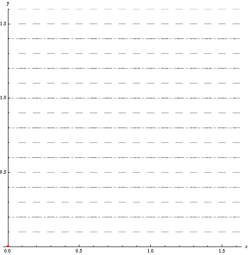

# AE831
## Continuum Mechanics
Lecture 14 - Newtonian Fluids 
Dr. Nicholas Smith 
Wichita State University, Department of Aerospace Engineering

3 November, 2020

----
## schedule

- 3 Nov - Newtonian Fluids
- 5 Nov - Experimental Rheology
- 10 Nov - Energy, Rotation, Vorticity
- 12 Nov - Compressible Flow, HW8 Due
- 17 Nov - Non-Newtonian Fluids

----
## outline

<!-- vim-markdown-toc GFM -->

* newtonian fluids
* flow conditions

<!-- vim-markdown-toc -->

---
# newtonian fluids

----
## fluids in rigid motion

- We define a fluid as a material which is unable to resist shear stress at rest
- For a fluid in rigid body motion, the stress vector on any plane will be normal to that plane 
`\[T_{ij}n_j = \lambda n_j\]`

- The symmetry of the stress tensor leads us to find that
`\[T_{ij} = -p \delta_{ij}\]`

----
## fluid compressibility

- Most liquids can be treated as incompressible in many fluid problems
- Their change in density is negligible under a wide range of pressures
- Most gases, however, must be treated as compressible
- Recall the conservation of mass
`\[\frac{D}{Dt} \rho + \rho \frac{\partial v_k}{\partial x_k} = 0\]`

----
## fluid compressibility

- Which for an incompressible material becomes
`\[\frac{\partial v_k}{\partial x_k} = 0\]`

- Density of an incompressible material can vary in space, as long as it does not vary in time

----
## hydrostatics

- If we substitute `\(T_{ij} = -p \delta_{ij}\)` into the equilibrium equations, we find 
`\[\frac{\partial p}{\partial x_i} = \rho B_i\]`

- If gravity is the only body force and acts in `\(x_3\)`, then pressure will only be a function of `\(x_3\)` (for static fluid)
- If the fluid is in rigid body motion then we have
`\[-\frac{\partial p}{\partial x_i} + \rho B_i = \rho a_i\]`

----
## example

- You are planning to load your fish tank into your friend's car for transportation
- Your friend brags that he can accelerate from 0 to 60 in 5 seconds
- Assuming this is true, and your tank is 2'x4' and 2' deep, how deep can you fill the tank without allowing any spilling due to acceleration?

----
## general motion of fluids

- For a fluid in general motion, we de-compose the stress tensor into two portions 
`\[T_{ij} = -p \delta_{ij} + T_{ij}^\prime\]`

- Where `\(T_{ij}^\prime\)` depends only on the rate of deformation and `\(p\)` is a scalar which does not depend on the rate of deformation

----
## newtonian fluids

- For a fluid to be Newtonian, we make two assumptions
- First, we assume that `\(T_{ij}^\prime\)` is linearly dependent on `\(D_{ij}\)` and nothing else
- Second, we assume the fluid is isotropic
- This gives
`\[T_{ij}^\prime = \lambda D_{kk}\delta_{ij} + 2\mu D_{ij}\]`

----
## physical interpretation

- If we consider a shear flow given by the velocity field
`\[v_1 = f(x_2) \qquad v_2 = v_3 = 0\]`

- We have a rate of deformation tensor with
`\[D_{12} = \frac{1}{2} \frac{d v_1}{d x_2}\]`

----
## physical interpretation

- With all other `\(D_{ij} = 0\)`
- Thus we find `\(T_{12} = \mu \frac{dv_1}{dx_2}\)`
- `\(\mu\)` relates shear stress to the rate of change of the angle, is known as viscosity

----
## physical interpretation

- For a general velocity field, if we take `\(1/3\)` of the contraction of the viscous stress tensor, we find
`\[\frac{1}{3} T_{ii}^\prime = \left(\lambda + \frac{2\mu}{3}\right) D_{ii}\]`

- The quantity `\(\left(\lambda + \frac{2\mu}{3}\right)\)` relates the mean viscous normal stress to the change in volume
- It is often referred to as the bulk viscosity

----
## incompressible fluid

- If a fluid is considered to be incompressible, then `\(D_{ii} = 0\)`
- This gives the constitutive equation
`\[T_{ij} = -p \delta_{ij} + 2\mu D_{ij}\]`

- It is convenient to write it in terms of the velocity vector
`\[T_{ij} = -p \delta_{ij} + 2\mu (v_{i,j} + v_{j,i})\]`

----
## navier-stokes

- If we recall Navier-Stokes equations of motion
`\[\rho \left ( \frac{\partial v_i}{\partial t} + v_j \frac{\partial v_i}{\partial x_j}\right) = \frac{\partial T_{ij}}{\partial x_j} + \rho B_i\]`

- We can substitute the constitutive equation for newtonian fluids to find
`\[\rho \left ( \frac{\partial v_i}{\partial t} + v_j \frac{\partial v_i}{\partial x_j}\right) = \rho B_i - \frac{\partial p}{\partial x_i} + \mu \frac{\partial ^2 v_i}{\partial x_j \partial x_j}\]`

----
## navier-stokes

- This gives three equations with four unknowns, we use the continuity equation to find the fourth unknown
`\[\frac{\partial v_i}{\partial x_i} = 0\]`

----
## cylindrical and spherical coordinates

- Navier-Stokes equations in cylindrical and spherical coordinates are found on p. 364-365 of the text
- There is a typo in 6.8.1, should read 
`\[ \begin{gathered}
	\frac{\partial v_r}{\partial r} + v_r \frac{\partial v_r}{\partial r} + \frac{v_\theta}{r} \left(\frac{\partial v_r}{\partial \theta} - v_\theta\right) + v_z \frac{\partial v_r}{\partial z} = -\frac{1}{\rho} \frac{\partial p}{\partial r} + B_r\\
	+\frac{\mu}{\rho} \left[\frac{\partial ^2 v_r}{\partial r^2} + \frac{1}{r^2}\frac{\partial^2v_r}{\partial \theta^2} + \frac{\partial^2v_r}{\partial z^2} + \frac{1}{r}\frac{\partial v_r}{\partial r} - \frac{2}{r^2}\frac{\partial v_\theta}{\partial \theta} - \frac{v_r}{r^2}\right]
\end{gathered} \]`

---
# flow conditions

----
## nonslip

- A common assumption is that of *nonslip* boundaries
- Agrees well with experiments
- Both Newtonian and non-Newtonian fluids
- Fluid moves with boundary, for rigid boundaries the velocity at the boundary is 0

----
## streamline

- In general, fluid flow is characterized by a velocity field
- As a vector field, there are different ways in which to visualize the field
- Streamlines, pathlines, streaklines and timelines are common ways we talk about fluids

----
## steady and unsteady flow

- A flow is called *steady* if it is fixed in time (at a fixed location)
- Otherwise it is called unsteady
- Steady flow does not mean the material derivative is zero (`\(D\Psi/Dt \ne 0\)`)
- But it does mean that the partial derivative with respect to time is zero (`\(\partial \Psi / \partial t = 0\)`)
- For steady flow, streamlines, streaklines, and pathlines are the same

----
## streamline

- A streamline is a curve which is instantaneously tangent to the velocity vector
- Experimentally, streamlines can be found on the surface of a fluid by sprinkling reflective particles and making a short-time exposure photograph
- Mathematically, streamlines can be found by considering a parametric equation for a curve `\(x_i = x_i(s)\)`
- We choose `\(s\)` so that `\(dx_i/ds = v_i\)` and `\(s=0\)` corresponds to the point `\(x_0\)`, which is the originating point of our streamline

----
## streamline example

- Given the velocity field
`\[v_i = \langle \frac{kx_1}{1+\alpha t}, kx_2, 0 \rangle\]` 

find the streamline passing through `\((a_1,a_2,a_3)\)` at time `\(t\)`

----
## pathline

- A pathline is the path traversed by a fluid particle
- Experimentally, pathlines can be found by using one reflective particle and a long-time exposure photograph
- Mathematically, the pathline can be obtained from the velocity field
as follows 
`\[\begin{aligned}
	\frac{dx_i}{dt} &= v_i(x_i,t)\\
	x_i(t_0) = X_i
\end{aligned}\]`

----
## pathline example

- Given the velocity field
`\[v_i = \langle \frac{kx_1}{1+\alpha t}, kx_2, 0 \rangle\]` 

find the pathline passing through `\((a_1,a_2,a_3)\)` at time \(t\)

----
## streakline

- Streaklines are commonly found experimentally, but are difficult to express mathematically
- A streakline is formed when dye is steadily injected into a fluid from a fixed point
- The path that the very first point of dye follows is a pathline
- But the dye following behind is altered by the changing flow field, which makes the streakline left by the continuously injected dye different from a pathline

----
## timeline

- The final common method for visualizing fluid flows is known as a timeline
- Fluid particles are marked at a given instance of time (often forming a line at `\(t_0\)`)
- After set intervals of time, lines are drawn between these particles
- These lines are called timelines

----
## animation
 <!-- .element width="40%" -->

----
## laminar flow

- Laminar flow is very orderly
- Fluid particles move in smooth layers (*laminae*)
- Occurs when fluid flow is relatively slow

----
## reynolds number

- Dimensionless parameter to compare how "fast" or "slow" a fluid is moving
- For experiments under otherwise identical conditions, reynolds number is used to determine whether flow will be laminar
- Ratio of inertial forces to viscous forces

----
## reynolds number

- In a tube, Reynolds number is 
`\[N_R = \frac{v_m \rho d}{\mu}\]`

- For water in a tube, `\(N_R < 2100\)` gives laminar flow

----
## turbulent flow

- In laminar flow, small perturbations are quickly overcome
- For turbulent flow, unsteady vortices appear and interact with each other
- Turbulent flows are highly irregular and chaotic
- Turbulence increases diffusivity, causing fluids to mix more quickly
- High Reynolds numbers correspond to turbulence, but how high depends on the specific experiment
- There is often a large transition range between laminar and turbulent flow

----
## reading

- pp 365-375
