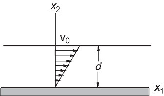
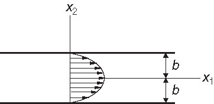
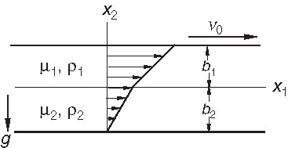
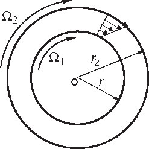
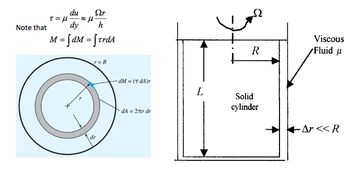
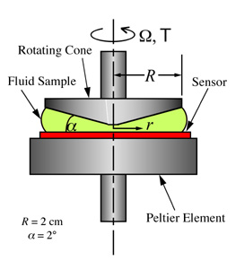
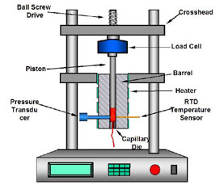
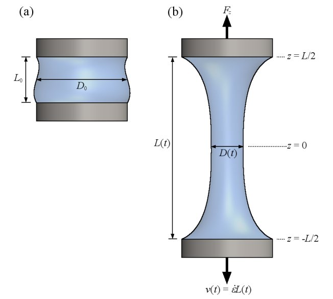
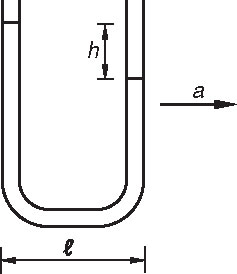

# AE831
## Continuum Mechanics
Lecture 15 - Experimental Rheology 
Dr. Nicholas Smith 
Wichita State University, Department of Aerospace Engineering

5 November, 2020

----
## schedule

- 5 Nov - Experimental Rheology
- 10 Nov - Energy, Rotation, Vorticity
- 12 Nov - Compressible Flow, HW8 Due
- 17 Nov - Non-Newtonian Fluids

---
# flow models

----
## plane couette flow

----
## plane couette flow

- Steady unidirectional flow of an incompressible fluid between two horizontal plates with no pressure gradient in the flow direction is known as plane Couette flow
- one plate is fixed and the other moves with a constant velocity ``\(v_0\)``
- From the continuity equation 
``\[v_i = \langle v(x_2), 0, 0 \rangle\]``

- From Navier-Stokes we find 
``\[v(x_2) = \frac{v_0 x_2}{d}\]``

----
## plane poiseuille flow

- Steady, unidirectional flow between two fixed plates
- Initial form for ``\(v_i\)`` is same as plane Couette flow
- Navier-Stokes gives 
``\[\begin{aligned}
	\frac{\partial p}{\partial x_1} &= \mu \frac{d^2 v}{dx_2^2}\\
	\frac{\partial p}{\partial x_2} &= 0\\
	\frac{\partial p}{\partial x_3} &= 0
\end{aligned}\]``

----
## plane poisseuille flow

----
## hagen-poiseuille flow

- Steady, unidirectional axisymmetric flow in a circular cylinder
``\[v_r = v_\theta = 0, \qquad v_z = v(r)\]``

- From the Navier-Stokes equations, we find 
``\[\begin{aligned}
	\frac{\partial p}{\partial r} &= 0\\
	\frac{\partial p}{\partial \theta} &= 0\\
	-\frac{\partial p}{\partial z} + \mu \left[\frac{1}{r} \frac{d}{dr}\left(r\frac{dv}{dr}\right)\right] &= 0
\end{aligned}\]``

----
## example

- Find the velocity field if there are two fluids (in layers) in plane couette flow

----
## couette flow

- Laminar, steady flow of an incompressible fluid between two rotating coaxial cylinders is called Couette flow
- The velocity field has the form
``\[v_r = 0, \qquad v_\theta = v(r), \qquad v_z = 0\]``

- Continuity is automatically satisfied, Navier-Stokes gives
``\[\frac{d^2v}{dr^2} + \frac{1}{r}\frac{dv}{dr}-\frac{v}{r^2} = 0\]``

----
## couette flow

----
## oscillating plane

- Flow near an oscillating plane will have the form
``\[v_i = \langle v(x_2,t), 0, 0 \rangle\]``

- The only non-trivial Navier-Stokes equation gives
``\[\rho \frac{\partial v}{\partial t} = \mu \frac{\partial ^2 v}{\partial x_2^2}\]``

- Which has the solution
``\[v = ae^{-\beta x_2} \cos (\omega t - \beta x_2 + \epsilon)\]``

---
# experimental rheology

----
## rotational cylinder

----
## rotational cylinder

- Couette flow with one of the cylinders fixed
- Shear rate is applied through a constant angular velocity of one of the cylinders
- Torque on the other cylinder is measured
- Used for fluids with very low viscosity

----
## cone and plate

----
## cone and plate

- One of the two plates is held fixed and torque is measured
- The other rotates at an applied angular velocity
- Cones are used to provide a constant shear rate, also use less fluid volume
- Parallel plates are more flexible in the spacing, also used for very temperature-sensitive tests

----
## capillary rheometer

----
## capillary rheometer

- Used for testing higher shear-rates than rotational rheometers
- Commonly used for polymers (which are non-newtonian and have rate-dependent viscosity)
- Usually flow-rate is controlled and pressure drop is measured (but either can be controlled)
- Flow-rate can be converted to find the shear-rate, pressure drop can be converted to shear stress

----
## dynamic

- For materials which are viscoelastic, dynamic tests are used
- Either an oscillating rotational rheometer (for more liquid)
- Or an oscillating tensile test (for more elastic materials)

----
## extensional rheometry

----
## extensional rheometry

- Another common test for polymer melts and viscoelastic materials
- Extensional viscosity is a function of both the applied stretch rate and the total deformation of the material
- Extrusion-based processes depend on extensional viscosity

---
# group problems

----
## group 1

- Find velocity field of water pumped up a hill through a narrow channel
- Slope of channel is `\(45^\circ\)`
- Assume the only body forces present are due to gravity
- Note: solution will be in terms of pressure

----
## group 2

- Given the following polar coordinate velocity field
`\[v_r = \frac{Q}{2 \pi r} \qquad v_\theta = 0\]`

- Find the streamline passing through some arbitrary point `\((r_0,\theta_0)\)` and the pathline originating from `\((R,\Theta)\)` at `\(t = 0\)`

----
## group 3

- A slender U-tube moves to the right with some acceleration, `\(a\)`.
- Find the relation between `\(a\)`, the width of the tube, `\(l\)` and the difference in height levels of water at different ends of the tube, `\(h\)`
- Note: do not neglect gravity

----
## reading

- pp 375-402
