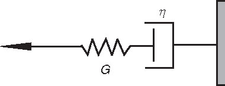
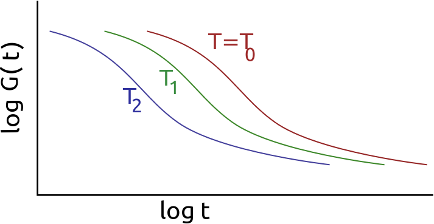
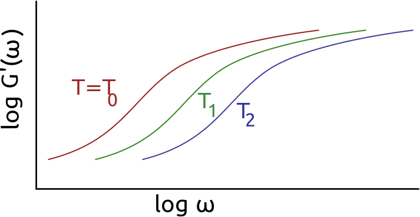
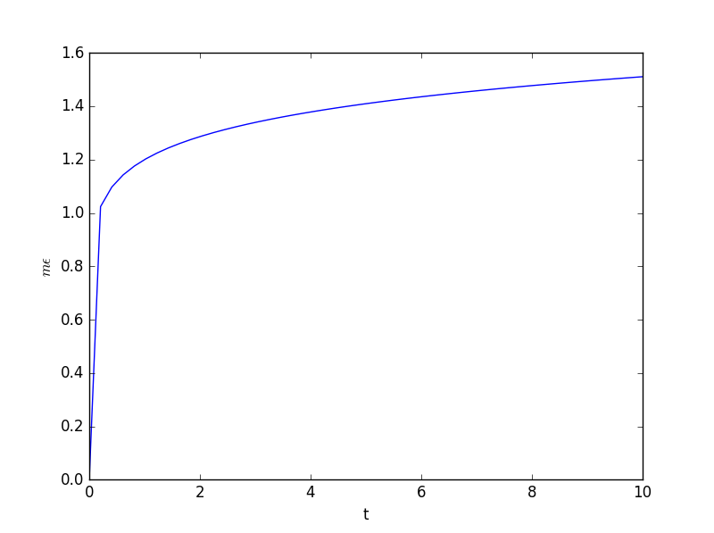
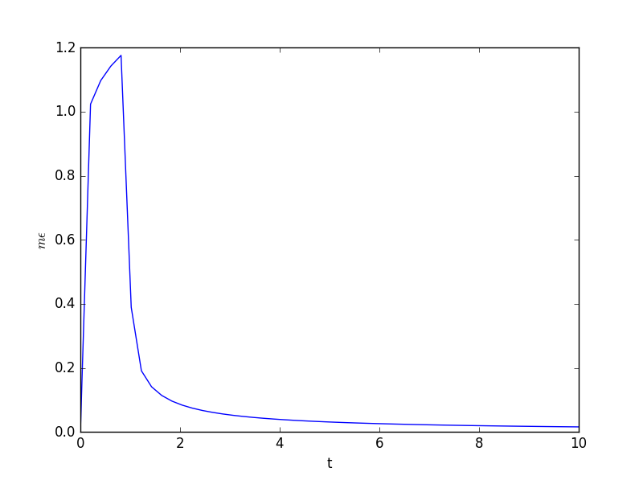

# AE831
## Continuum Mechanics
Lecture 17 - Non-Newtonian Fluids 
Dr. Nicholas Smith 
Wichita State University, Department of Aerospace Engineering

17 November, 2020

----
## schedule

- 17 Nov - Non-Newtonian Fluids
- 1 Dec - Final Review, Research Project, HW9 Due
- 3 Dec - Final Review

----
## outline

<!-- vim-markdown-toc GFM -->

* non-newtonian fluids
* maxwell fluid
* other viscoelastic models
* dynamic properties
* time temperature superposition
* boltzman superposition
* experimental characterization

<!-- vim-markdown-toc -->

---
# non-newtonian fluids

----
## non-newtonian fluids

- For a fluid to be Newtonian we assumed that `\(T_{ij}^\prime\)` is linearly dependent on `\(D_{ij}\)` and nothing else
- In many fluids `\(T_{ij}^\prime\)` is not linearly dependent on `\(D_{ij}\)`
- These fluids are most commonly referred to as shear-thinning or shear-thickening fluids
- Their viscosity is a function of the strain-rate applied

----
## shear thinning fluids

- Shear-thinning fluids decrease in viscosity with an increase in strain-rate
- Some examples are ketchup, paint, whipped cream, quicksand and blood
- Shear-thinning is generally only an effect in complex fluids (polymers and solutions)
- At the molecular level, research is still being done to discover why a fluid would be shear-thinning

----
## shear-thickening fluids

- Shear-thickening fluids increase viscosity with an increased strain-rate
- Generally occurs in suspensions (many polymer melts are suspensions)
- Cornstarch and water, silica and polyethylene glycol
- Uses include body armor and brake pads

----
## generalized newtonian fluids

- Many non-newtonian fluids have a viscosity which does not depend on the history, only on the current shear-rate
- In this case, the fluid can be modeled as a generalized Newtonian fluid 
`\[T_{ij}^\prime = \mu (D_{ij}) D_{ij}\]`

- Some common models for `\(\mu (D_{ij})\)` are Power-Law, Cross, and Carreau

----
## linear viscoelasticity

- We discussed fluids where `\(T_{ij}^\prime\)` is not linearly dependent on `\(D_{ij}\)`, but if `\(T_{ij}^\prime\)` depends on some other measure (such as strain), the fluid is also non-newtonian
- Linear viscoelastic materials have a linear dependence on `\(D_{ij}\)`, but also depend on `\(E_{ij}\)`
- Viscoelasticity can be used to model behavior in both liquids (die swell in polymer melts) and solids (creep and stress relaxation)

---
# maxwell fluid

----
## maxwell fluid

- In general, a Maxwell fluid is defined by the constitutive equation
`\[T_{ij} = -p \delta_{ij} + S_{ij}\]`

- Where `\(S\)` is the "extra stress"
`\[S_{ij} + \lambda \frac{\partial S_{ij}}{\partial t} = 2 \mu D_{ij}\]`

- In 1D, a Maxwell fluid can be considered as a spring and dashpot connected in series

----
## maxwell fluid

----
## creep

- We can model the creep behavior of a 1D Maxwell fluid by considering a constant applied force, `\(F_0\)`
- For a 1D Maxwell fluid we have
`\[F + \lambda \frac{dF}{dt} = \eta \frac{d \epsilon}{dt}\]`

- If `\(F=F_0\)`, then `\(\frac{dF}{dt}=0\)` so we have
`\[F_0 = \eta \frac{d \epsilon}{dt}\]`

- So the strain will be given by
`\[\epsilon = \int \frac{F_0}{\eta} dt = \frac{F_0}{\eta}t + \epsilon_0\]`

----
## creep

- Since `\(\epsilon_0\)` represents the initial strain, we can write `\(\epsilon_0 = F_0/G\)` where `\(G\)` is the spring constant
- In shear the creep compliance is often called `\(J(t)\)`, and represents the strain divided by the applied force
- For this fluid the creep compliance function is
`\[J(t) = \frac{\epsilon}{F_0} = \frac{1}{\eta} t + \frac{1}{G}\]`

----
## stress relaxation

- To model stress relaxation, we consider a constant applied strain, `\(\epsilon_0\)`, and see what effect that has on the stress
- In this case `\(\frac{d \epsilon}{dt}=0\)` and we have
`\[F + \lambda \frac{dF}{dt} = 0\]`

- solving this differential equation gives
`\[F = F_0 e^{-t G/\eta} = G\epsilon_0e^{-t G/\eta}\]`

- The stress relaxation function, `\(\phi(t)\)` is `\(F/\epsilon_0\)` which gives 
`\[\phi(t) = Ge^{-t G/\eta}\]`

----
## notation

- Creep and stress relaxation work often uses a different notation than what we are accustomed to
- `\(J(t)\)` is shear creep compliance, `\(D(t)\)` is tensile creep compliance
- Compliance is most commonly used, but sometimes `\(G(t)\)` for shear stiffness and `\(E(t)\)` for tensile stiffness are used
- Due to the time history dependence, in general 
`\[G(t) \ne 1/J(t)\]`

----
## example

- A rod is initially 12" long and 2" in diameter
- Find the stretch after a 20 lb weight is hung for 24 hours
- Tensile compliance is given by
`\[D = 0.5-\exp(-0.03t) \text{ Mpsi}^{-1}\]`

---
# other viscoelastic models

----
## solids

- A Maxwell fluid has an elastic portion, but behaves mostly like a fluid
- Many viscoelastic models are for solids, which have some viscous or damping behavior, but are mostly solid-like
- The Kelvin-Voigt model connects a spring and dashpot in parallel, and is the simplest form of viscoelastic model for solids

----
## kelvin-voigt

----
## zener model

- Both the Maxwell and Kelvin-Voigt models are overly simple to describe many real viscoelastic materials
- The Zener model combines the two, it can be viewed either as a spring in series with a Kelvin-Voigt solid or as a spring in parallel with a Maxwell fluid
- Also called a standard linear solid
- Can be further extended for polymers with a distribution of relaxation times
- Multiple Kelvin-Voigt elements are connected in series, with a spring connected in series

----
## zener model

---
# dynamic properties

----
## dynamic properties

- You have probably noticed that plastic cups do not ring as long as glasses or metal objects
- This is due to the damping properties of viscoelastic materials
- Polymers are often used to dampen vibrations for this reason
- Damping will vary with frequency, we can model the effects

----
## dynamic properties

- If we assume some sinusoidal applied strain, `\(\epsilon(t) = \epsilon_0 \sin \omega t\)`
- In general, the viscoelastic stress response will be out of phase
`\[\sigma = \sigma_0 \sin (\omega t + \delta)\]`

- We can re-write this as
`\[\sigma = (\sigma_0 \cos \delta) \sin \omega t + (\sigma_0 \sin \delta) \cos \omega t\]`

----
## dynamic properties

- We can further re-write the equation in terms of a so-called "storage modulus" and "loss modulus"
`\[\sigma = \epsilon_0[ E^\prime \sin \omega t + E^{\prime \prime} \cos \omega t]\]`

- The storage modulus, `\(E^\prime\)` corresponds to the elastic response
- The loss modulus, `\(E^{\prime \prime}\)` corresponds to the viscous response

----
## complex representation

- The dynamic response is analogous to electric circuits, and can be expressed in a similar fashion using a complex representation
`\[\begin{aligned}
	\epsilon^* &= \epsilon_0 \exp i \omega t\\
	\sigma^* &= \sigma_0 \exp i(\omega t + \delta)
\end{aligned}\]`

- This gives the complex modulus as 
`\[\begin{aligned}
	E^* &= \sigma^*/\epsilon^*\\
	&= \frac{\sigma_0 }{ \epsilon_0} \exp i \delta\\
	&= \frac{\sigma_0 }{ \epsilon_0} (\cos \delta + i \sin \delta)\\
	&= E^\prime + i E^{\prime \prime}
\end{aligned}\]`

----
## damping

 - We can characterize the amount of damping in a viscoelastic material with `\(\delta\)`
`\[\tan \delta = \frac{D^{\prime \prime}}{D^\prime} = \frac{E^{\prime \prime}}{E^\prime}\]`

- When `\(\delta = 0\)` there is no viscous damping (most metals have `\(\delta \approx 0\)`)
- Polymers in certain temperature ranges can have `\(\delta\)` as high as `\(30^\circ\)`
- Note: at the same temperature and frequency, `\(E^* = 1/D^*\)` and `\(G^* = 1/J^*\)`

----
## example

- Consider the same bar as before (12" long and 2" in diameter)
- The bar is subjected to a sinusoidal force with `\(F_0 = 50\)` lbs and 80 Hz. 
`\[D^{\prime \prime} = 40 \text{ ksi}\]`

---
# time temperature superposition

----
## temperature dependency

- In both the time and frequency domain, many viscoelastic materials are temperature dependent
- In terms of our 1D models, the viscous portion is much more temperature dependent than the elastic portion
- The two most common models of temperature dependence are the Arrhenius model and the Williams-Landel-Ferry (WLF) model

----
## time-temperature

----
## frequency-temperature

----
## temperature shift

- Both Arrhenius and WLF models us the parameter `\(a_T\)` as the temperature shift
- `\(a_T = a_T(T,T_0)\)`
- For compliance (`\(J\)` and `\(D\)`) 
`\[J^{T_0}(t) = J^T(a_T t)\]`

- And for stiffness (`\(G\)` and `\(E\)`)
`\[D^{T_0}(t) = D^{T}\left(\frac{t}{a_T}\right)\]`

----
## arrhenius

- The Arrhenius function only uses one curve-fit parameter
`\[a_T = \exp \left(\frac{\Delta H}{R} \left[\frac{1}{T}-\frac{1}{T_R}\right]\right)\]`

- `\(R\)` is the universal gas constant
- Theoretically, `\(\Delta H\)` is the activation enthalpy of the relaxation
- `\(T\)` is the temperature and `\(T_0\)` is the reference temperature
- Popular model because the constants have some physical meaning, but they are still curve fit

----
## williams-landel-ferry

- The Williams-Landel-Ferry model is given by
`\[\log(a_T) = \frac{-C_1 (T-T_R)}{C_2 + (T-T_R)}\]`

- `\(C_1\)` and `\(C_2\)` are the curve-fit parameters
- Most optimization algorithms perform poorly with exponential functions, so it is best to solve for `\(\log(a_T)\)`

----
## characterization example 

rendered version of example can be found at [here](http://nbviewer.jupyter.org/github/ndaman/continuum/blob/master/tts/time-temperature-superposition.ipynb)

---
# boltzman superposition

----
## boltzman superposition

- What if we had one load applied at `\(t_0 = 0\)`, we would have
`\[\epsilon_0 = \sigma_0 D(t)\]`

- And some other load applied at `\(t_1\)` would give
`\[\epsilon_1 = \sigma_1 D(t-t_1)\]`

- Thus the total strain would be:
`\[\epsilon = \epsilon_0 + \epsilon_1 = \sigma_0 D(t) + \sigma_1 D(t-t_1)\]`

----
## boltzman superposition

- For `\(N\)` applied loads, we have
`\[\epsilon(t) = \Delta \sigma_1 D(t-t_1) + \Delta \sigma_2 D(t-t_2) + ... + \Delta \sigma_N D(t-t_N)\]`

- For some general, arbitrary loading function, this gives
`\[\epsilon(t) = \int_{0}^t D(t-u) \frac{d\sigma}{du}du\]`

----
## example

- For example, when we apply a load and then remove it, we have
`\[\epsilon(t) = \sigma_0 D(t) - \sigma_0 D(t-t_1)\]`

- If we consider `\(D=1.2t^{0.1} \text{ GPa}^{-1}\)` and let `\(\sigma_0 = 1 \text { MPa}\)` and `\(t_1 = 1\text{ s}\)`, then we have
`\[\epsilon(t) = \left( 1.2 t^{0.1} - 1.2(t-1)^{0.1} \right)\]`

----
## example

----
## example

---
# experimental characterization

----
## experimental characterization

- In practice, both the dynamic properties and time-temperature superposition are often used to characterize viscoelastic materials
- Dynamic experiments are much faster than creep experiments, and can give the same information
- There are physical limitations to the frequencies that can be applied
- To go beyond those frequencies, a range of temperatures are tested
- This can typically be done using a Dyanmic Mechanical Analyzer (DMA)

----
## dynamic mechanical analyzer

- To characterize a viscoelastic material in a DMA, tests are run over a range of frequencies
- At each frequency we measure both the stress and strain
- Plotting both, we can find the complex modulus (or compliance) at that frequency
- Over a range of frequencies this gives the complex modulus as a function of frequency
- Only a few cycles are needed to fit the curve

----
## other considerations

- When creep and/or stress relaxation experiments must be done, time-temperature superposition can still be used
- Creep or relaxation experiments are run under various temperatures, as in our example
